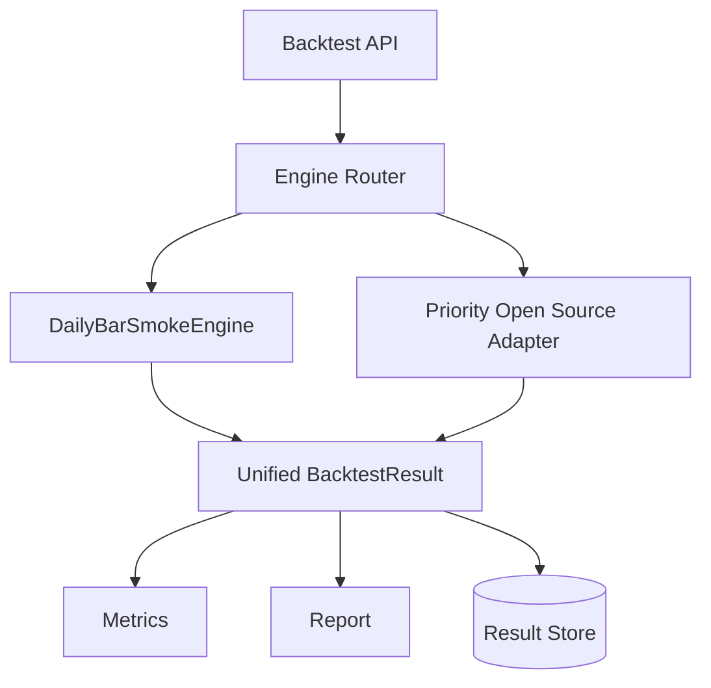

# Backtest Engine Module Design

## Status

- Scope: backtest request, engine adapters, metrics, reports, and stored results
- Owner: quant-trade maintainers
- Status: active target design
- Last Updated: 2026-05-13

## Goals And Non-Goals

Goals:

- Validate strategies on historical data with reproducible results.
- Keep the current daily engine as a smoke engine.
- Add mature external backtest engines through adapters.
- Standardize reports across engines.

Non-goals:

- Backtest does not prove live tradability by itself.
- External engines must not call real broker APIs.

## Current State

- `BacktestEngine` runs daily-bar simulation over local CSV bars.
- It returns metrics, equity curve, orders, fills, and position snapshots.
- The current simulator uses simplified daily close matching.
- No adapter interface or external engine exists yet.

## Target Design



The first external adapter should be chosen for A-share daily research fit, maintainability, and low integration cost. Other engines remain later extensions.

## Core Interfaces And APIs

```text
BacktestEngineAdapter
- engine_type
- run(request) -> BacktestResult

BacktestRequest
- run_id
- strategy_id
- strategy_version
- engine_type
- universe
- start_date
- end_date
- initial_cash
- benchmark
- fee_model
- slippage_model
- data_version
- parameters
```

API:

- `POST /api/v1/backtest-runs`
- `GET /api/v1/backtest-runs/{run_id}`
- future: `GET /api/v1/backtest-runs?strategy_id=&engine_type=`

## Data And State Model

`BacktestResult`:

- metrics: return, benchmark return, max drawdown, volatility, Sharpe, Sortino, turnover, trade count, fees, slippage.
- curves: equity, drawdown, exposure.
- details: orders, fills, positions, factor exposure, risk report.
- versions: strategy version and data version.

A-share rules:

- 100-share lot size.
- T+1 sellability.
- suspension and limit-up/down handling.
- commission, stamp tax, optional transfer fee.
- slippage and volume participation limits.

## Failure Handling And Security

- Separate signal time from execution time to avoid look-ahead bias.
- Refuse backtests where data version or date range is invalid.
- Record adapter errors in run state without corrupting previous results.
- Do not use live account credentials or broker endpoints in backtest adapters.

## Tests And Acceptance

- Golden smoke backtest metrics.
- Adapter contract tests using fixed data.
- A-share lot, T+1, suspension, limit, fee, and slippage tests.
- Reproducibility test: same request and data version produce same result.
- Reports can be displayed in Web.

## Dependencies

- Consumes `quant-data`, `decision-engine`, and strategy definitions.
- Produces reports for `web-console`.
- Shares order/fill vocabulary with `contracts` and paper trading.

## Phased Delivery

1. Rename current behavior conceptually to smoke engine while preserving API compatibility.
2. Define adapter interface and unified result.
3. Add one external adapter.
4. Add parameter search and walk-forward reports.
