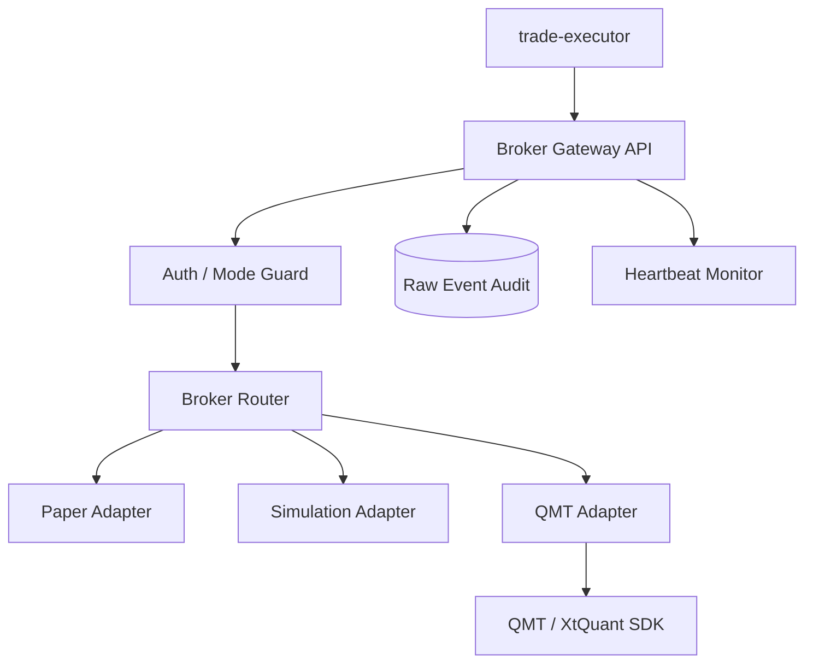

# Broker Gateway Module Design

## Status

- Scope: future broker API isolation service for Paper, Sim, QMT, and live broker operations
- Owner: quant-trade maintainers
- Status: target design
- Last Updated: 2026-05-13

## Goals And Non-Goals

Goals:

- Isolate broker SDK dependencies from `trade-executor`.
- Provide one normalized broker API for account, positions, orders, fills, placement, and cancel.
- Enforce mode guards: readonly, paper, sim, live-small, live.
- Preserve broker raw events for audit and diagnosis.

Non-goals:

- It does not generate strategy signals.
- It does not decide risk approval.
- It does not make live mode safe without executor and kill switch controls.

## Current State

- Java `trade-executor` contains `Broker`, `PaperBroker`, and `QmtBroker` scaffold.
- No separate root-level `broker-gateway` service exists.
- QMT readonly/live integration is pending.

## Target Design



## Core Interfaces And APIs

APIs:

- `GET /health`
- `GET /api/v1/account`
- `GET /api/v1/positions`
- `GET /api/v1/orders`
- `GET /api/v1/fills`
- `POST /api/v1/orders`
- `DELETE /api/v1/orders/{broker_order_id}`
- `GET /api/v1/mode`
- `POST /api/v1/mode`

Business APIs use the project response envelope: `success`, `data`, `error`, and `meta`.

Order placement request:

```text
client_order_id
account_id
symbol
side
quantity
order_type
limit_price
trace_id
```

## Data And State Model

Broker payloads:

- account snapshot.
- broker position.
- broker order.
- broker fill.
- broker raw event.
- heartbeat status.

Modes:

- `paper`: simulated broker.
- `readonly`: real account queries only.
- `live_sim`: real snapshot, simulated placement.
- `live_small`: limited live orders with approval and limits.
- `live`: guarded automation.

## Failure Handling And Security

- Readonly mode must reject placement and cancel APIs.
- Live modes require explicit enablement and kill switch checks.
- Heartbeat failure blocks new opening orders.
- Unknown broker status is returned as unknown, not retried internally.
- Broker credentials must be provided through environment or secret manager, never repo files.
- Raw broker responses are audited with sensitive values redacted.

## Tests And Acceptance

- Readonly cannot place or cancel.
- Paper and sim modes can return deterministic snapshots.
- QMT disconnect creates heartbeat failure.
- Every placement has client order id and trace id.
- Unknown status is visible to executor and ledger.

## Dependencies

- Consumed by `trade-executor`.
- Uses `contracts/broker` payloads.
- Feeds observability and Web execution/live views.

## Phased Delivery

1. Keep broker abstractions inside `trade-executor` until gateway phase starts.
2. Extract PaperGateway first.
3. Add QMT readonly account queries and heartbeat.
4. Add live-sim, then live-small, then live.
