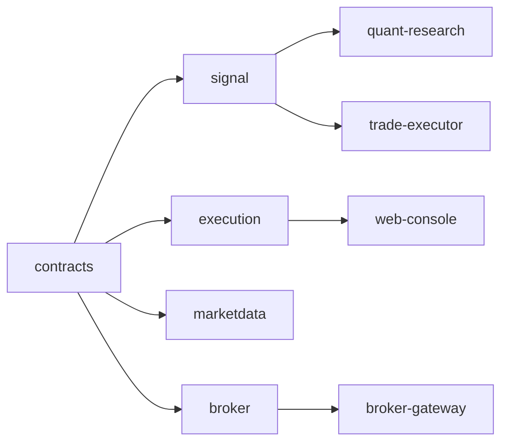

# Contracts Module Design

## Status

- Scope: cross-module contracts for signals, execution, market data, and broker payloads
- Owner: quant-trade maintainers
- Status: target design
- Last Updated: 2026-05-13

## Goals And Non-Goals

Goals:

- Keep Python, Java, Web, and future services aligned on stable payload shapes.
- Version all cross-language payloads before implementation depends on them.
- Make contract tests the first warning when schema semantics change.
- Prevent hidden coupling through ad hoc maps or undocumented fields.

Non-goals:

- Contracts do not implement business logic.
- Contracts do not replace storage schemas or service APIs.

## Current State

- `contracts/signal` contains Signal v1 JSON Schema, README, and an example.
- Python and Java tests validate the Signal v1 payload.
- Signal v1 does not yet include `trading_date`, `strategy_version`, `rebalance_cycle`, or `data_version`.
- Signal v1 documents idempotency as `strategy_id + as_of + account_id`, which is not stable enough for repeated execution.

## Target Design



Contracts should be organized by boundary:

- `signal`: target portfolio, signal state, validation result, explanation.
- `execution`: order intent, risk decision, order plan, execution report.
- `marketdata`: instrument, calendar, daily bar, quote, data quality report.
- `broker`: account snapshot, broker order, broker fill, broker position.

## Core Interfaces And Contracts

Signal v2 should add:

- `trading_date`: execution cycle date, not generation timestamp.
- `strategy_version`: immutable strategy version used to create the signal.
- `rebalance_cycle`: `DAILY_CLOSE`, `WEEKLY_CLOSE`, or `MONTHLY_CLOSE`.
- `data_version`: market-data snapshot used by the strategy.
- `status`: generated, validated, approved, published, consumed, executed, expired, canceled, or rejected.
- `metadata`: optional explicit extension area.

Stable idempotency target:

```text
strategy_id + strategy_version + account_id + trading_date + rebalance_cycle
```

This key must not use current wall-clock generation time because repeated pulls can otherwise produce distinct executable signals.

## Data And State Model

- Schema files use JSON Schema draft 2020-12.
- Examples are stored next to schemas and include both valid and invalid payloads.
- Breaking changes create a new major schema version.
- Compatible additions are allowed only when consumers can ignore or explicitly parse the field.

## Failure Handling And Security

- Unknown fields are rejected by default except in documented `metadata`.
- Contract validation errors must not leak account credentials or broker raw payloads.
- Checksums are computed over canonical payload content before the checksum field is set.
- Consumers must reject checksum mismatch before risk or order planning.

## Tests And Acceptance

- Python and Java parse the same valid examples.
- Invalid examples cover missing required fields, bad symbol format, overweight targets, stale status, and checksum mismatch.
- Signal v1 remains readable until v2 migration is complete.
- Signal v2 duplicate idempotency tests prove repeated execution is blocked.

## Dependencies

- `quant-research` produces signal and market-data payloads.
- `trade-executor` consumes signal, execution, and broker payloads.
- `broker-gateway` produces broker payloads.
- `web-console` displays all payloads but does not define them.

## Phased Delivery

1. Add Signal v2 schema and examples while keeping v1 tests.
2. Update Python models and Java DTOs to parse v2.
3. Add execution and broker schemas before adding new service APIs.
4. Deprecate v1 after all consumers use the stable idempotency key.
