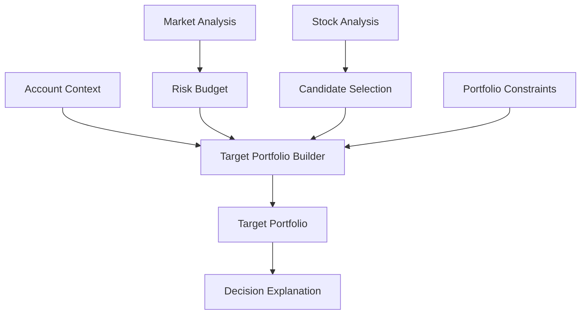

# Decision Engine Module Design

## Status

- Scope: portfolio decision and target-weight construction
- Owner: quant-trade maintainers
- Status: target design
- Last Updated: 2026-05-13

## Goals And Non-Goals

Goals:

- Convert market analysis, stock analysis, strategy rules, and account context into a target portfolio.
- Make every target position explainable.
- Keep output deterministic for the same inputs.
- Enforce portfolio constraints before signal creation.

Non-goals:

- It does not submit orders.
- It does not replace execution-side risk checks.
- It does not manage broker state.

## Current State

- `DailyEtfStockStrategy` creates static ETF and stock target weights.
- Strategy run output is persisted through the Python research service.
- No separate decision context, risk budget, sector exposure, or optimizer exists yet.

## Target Design



## Core Interfaces And Contracts

```text
DecisionEngine
- decide(context) -> DecisionResult

DecisionContext
- account_id
- trading_date
- strategy_id
- strategy_version
- data_version
- market_analysis
- stock_analysis
- current_positions
- cash
- universe
- risk_config

DecisionResult
- target_portfolio
- explanation
- rejected_symbols
- risk_budget
```

## Data And State Model

`TargetPortfolio`:

- cash target percentage.
- target positions with symbol, target percentage, confidence, and reason.
- constraints: max turnover, max single position, rebalance cycle, max drawdown, min amount, excluded tags.
- explanation: top reasons, factor contributions, risk notes.

Risk budget examples:

- `risk_on`: higher equity exposure, lower cash.
- `neutral`: balanced equity and cash.
- `risk_off`: high cash, lower single-name limits, no new aggressive positions.

## Failure Handling And Security

- Weight sum must not exceed one.
- Single-position and sector limits must be checked before signal generation.
- If market analysis is `risk_off`, the decision should either reduce exposure or explain why it refuses to generate a new long signal.
- All decisions should record input versions for replay.

## Tests And Acceptance

- Deterministic output for identical inputs.
- Weight sum, cash target, single-position, and turnover tests.
- Risk-on, neutral, and risk-off target allocation tests.
- Rejected symbols include reasons.

## Dependencies

- Consumes market and stock analysis.
- Produces target portfolio for `signal-service`, `backtest-engine`, and paper workflows.
- Shares constraints with `risk-engine`.

## Phased Delivery

1. Wrap current static strategy output in a DecisionResult shape.
2. Add risk budget based on market regime.
3. Add stock score selection and constraint-aware weighting.
4. Add optimizer only after simple deterministic rules are tested.
