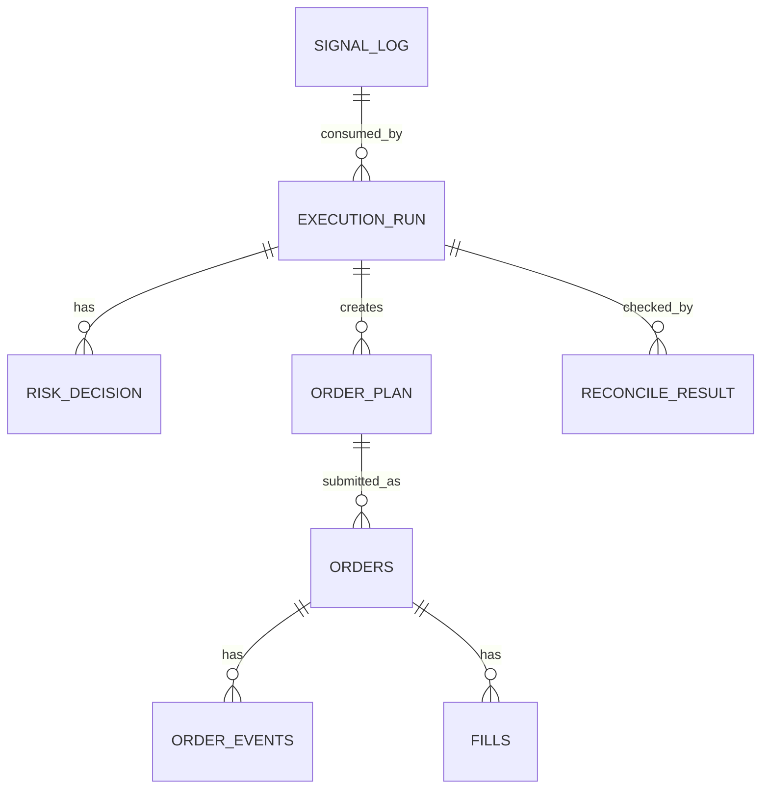

# Execution Ledger Module Design

## Status

- Scope: execution audit, idempotency, recovery, reconciliation, and replay storage
- Owner: quant-trade maintainers
- Status: active target design
- Last Updated: 2026-05-13

## Goals And Non-Goals

Goals:

- Persist every signal consumption, risk decision, order plan, order, event, fill, snapshot, and reconcile result.
- Provide idempotency protection before broker placement.
- Support recovery after process restart.
- Enable audit, reports, and incident replay.

Non-goals:

- It does not compute strategy decisions.
- It does not replace broker source-of-truth queries.
- It does not hide failed execution states.

## Current State

- Java has `ExecutionLedger` and `InMemoryExecutionLedger`.
- Flyway V1 migration exists for initial ledger tables.
- PostgreSQL-backed `JdbcExecutionLedger` is pending.
- Python research repository uses SQLite for local research and paper state.

## Target Design



## Core Interfaces And Contracts

```text
ExecutionLedger
- beginRun(signal, traceId)
- hasProcessed(idempotencyKey)
- saveRiskDecision(runId, decision)
- saveOrderPlan(runId, plan)
- saveOrderEvent(runId, event)
- saveFill(runId, fill)
- saveSnapshot(runId, accountSnapshot)
- saveReconcileResult(runId, result)
- markProcessed(runId)
- findRecoverableRuns()
```

## Data And State Model

Core tables:

- `signal_log`
- `execution_run`
- `risk_decision`
- `order_plan`
- `orders`
- `order_events`
- `fills`
- `account_snapshot`
- `positions_snapshot`
- `pnl_daily`
- `reconcile_result`
- `kill_switch_event`
- `audit_log`

Every execution row should carry `trace_id`, `account_id`, `signal_id`, and idempotency context where relevant.

## Failure Handling And Security

- Idempotency check and run creation must be transactionally safe.
- Broker placement should happen only after order plan persistence.
- Unknown order status remains visible until reconciled.
- Ledger errors in live mode should fail closed before broker placement.
- Sensitive broker raw payloads should be redacted or isolated.

## Tests And Acceptance

- Duplicate idempotency key is rejected or returns prior run.
- Restart recovery finds unfinished runs.
- Risk rejection, partial order placement, unknown status, and reconcile mismatch are persisted.
- Flyway migration tests validate table names, indexes, and constraints.
- Web can trace order and fill back to signal and run.

## Dependencies

- Owned by `trade-executor`.
- Stores payload references from `signal-service`, `risk-engine`, `order-planner`, `broker-gateway`, and reconciliation.
- Feeds `web-console` and observability.

## Phased Delivery

1. Implement `JdbcExecutionLedger` for current Java interfaces.
2. Add missing tables for execution run, risk decision, order plan, order events, fills, and snapshots.
3. Add recovery API and duplicate-execution tests.
4. Add replay and audit views.
