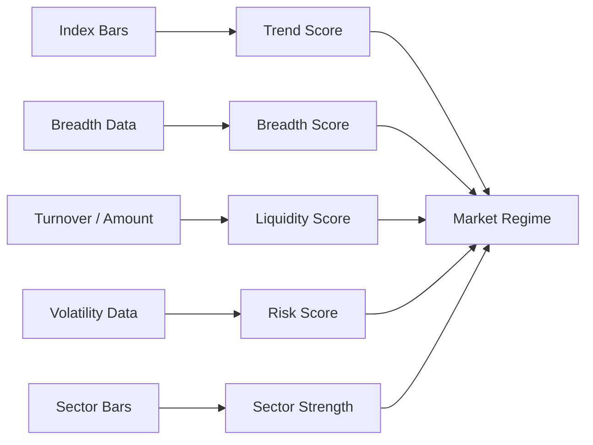

# Market Analyzer Module Design

## Status

- Scope: market regime, breadth, liquidity, volatility, and sector analysis
- Owner: quant-trade maintainers
- Status: target design
- Last Updated: 2026-05-13

## Goals And Non-Goals

Goals:

- Tell strategies whether the market is risk-on, neutral, or risk-off.
- Provide explainable scores for trend, breadth, liquidity, volatility, and sector strength.
- Produce data that Web, decision engine, and risk engine can reuse.

Non-goals:

- It does not select individual stocks by itself.
- It does not place orders or override execution risk.

## Current State

- No dedicated market analyzer module exists.
- Current strategy uses static ETF/stock allocation.
- Market bars are available only through the CSV provider and Web market table.

## Target Design



## Core Interfaces And APIs

Analyzer interface:

```text
MarketAnalyzer
- analyze(trading_date, data_version) -> MarketAnalysis
```

API:

- `GET /api/v1/market-analysis/latest`
- `GET /api/v1/market-analysis?trading_date=`

## Data And State Model

`MarketAnalysis`:

- trading date and data version.
- market regime: `risk_on`, `neutral`, `risk_off`.
- trend score, breadth score, liquidity score, volatility score.
- sector strength list.
- risk flags and explanation.

Example risk flags:

- broad market drawdown.
- liquidity contraction.
- many limit-down stocks.
- abnormal volatility.

## Failure Handling And Security

- If breadth or sector data is unavailable, the analyzer should degrade to a lower confidence result and explain missing inputs.
- If core index data is missing, it should fail the run rather than produce a false risk-on signal.
- Extreme risk flags should be passed to decision and risk modules.

## Tests And Acceptance

- Risk-on, neutral, and risk-off golden cases.
- Missing optional data produces warnings and lower confidence.
- Missing required index data fails clearly.
- Web can display regime, scores, sector strength, and explanations.

## Dependencies

- Consumes normalized bars and breadth/sector datasets from `quant-data`.
- Feeds `decision-engine`, `risk-engine`, and `web-console`.

## Phased Delivery

1. Start with index trend, drawdown, and amount-based liquidity.
2. Add breadth and limit-up/down statistics.
3. Add sector rotation and risk flags.
4. Persist market analysis snapshots with data version.
