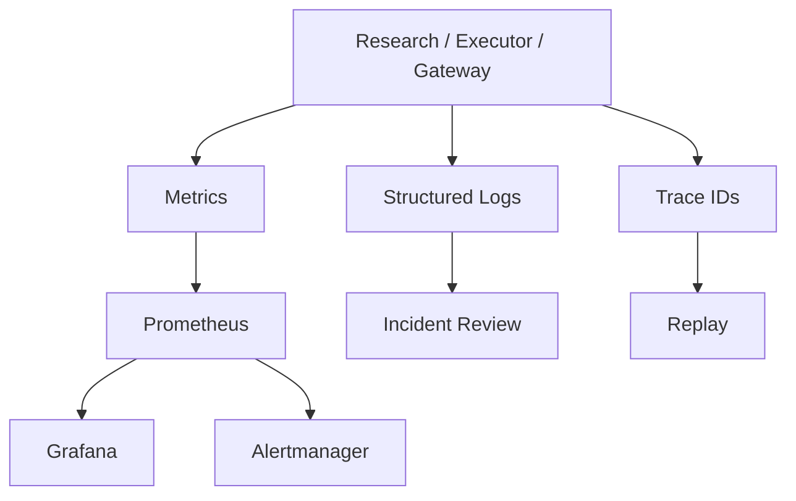

# Observability Module Design

## Status

- Scope: metrics, logs, traces, alerts, runbooks, and incident replay
- Owner: quant-trade maintainers
- Status: target design
- Last Updated: 2026-05-13

## Goals And Non-Goals

Goals:

- Detect failures in data, signal generation, execution, broker gateway, reconciliation, and live controls.
- Make every important event traceable by account, signal, execution run, and trace id.
- Provide alerting and runbook context for operational incidents.
- Support incident replay from stored inputs and ledger records.

Non-goals:

- Observability does not decide trades.
- It does not replace ledger audit records.
- It does not store broker credentials.

## Current State

- `infra/docker-compose.yml` exists.
- Operations runbook exists.
- Metrics, Prometheus, Grafana, alert rules, and trace propagation are pending.

## Target Design

## Core Interfaces And Metrics

Metrics:

- `service_up`
- `signal_generated_total`
- `signal_validation_failed_total`
- `execution_run_total`
- `execution_failed_total`
- `risk_rejected_total`
- `orders_submitted_total`
- `orders_failed_total`
- `orders_unknown_total`
- `fills_total`
- `reconcile_mismatch_total`
- `broker_heartbeat_lag_seconds`
- `kill_switch_active`
- `data_quality_failed_total`

Alert rules:

- Signal unavailable.
- Data quality failed.
- Broker heartbeat lost.
- High order failure rate.
- Unknown order status timeout.
- Reconciliation mismatch.
- Kill switch enabled.
- Risk circuit breaker triggered.

## Data And State Model

Correlation keys:

- `trace_id`
- `account_id`
- `signal_id`
- `idempotency_key`
- `execution_run_id`
- `client_order_id`
- `broker_order_id`

Important structured logs:

- signal generated, validated, published, consumed.
- risk decision.
- order planned, submitted, updated.
- fill received.
- reconcile completed.
- kill switch changed.

## Failure Handling And Security

- Alerts should include identifiers, not secrets or raw broker credentials.
- Critical alerts must point to runbook sections.
- If observability backend is unavailable, execution should continue in safe modes but still write ledger records.
- Live placement should not depend on metrics availability, but missing ledger/audit should fail closed.

## Tests And Acceptance

- Metrics endpoint exposes required counters and gauges.
- Execution run emits trace id through logs and ledger.
- Alert rule tests or dry-runs cover major alerts.
- Incident replay can load stored signal, risk, order plan, broker events, and snapshots.
- Web can show health and alert summary.

## Dependencies

- Consumes events from all platform modules.
- Uses ledger for durable audit.
- Supports operations runbooks and Web dashboard.

## Phased Delivery

1. Add trace id to execution run and logs.
2. Add Prometheus metrics for research and executor.
3. Add broker heartbeat and reconciliation alerts.
4. Add incident replay workflow.
