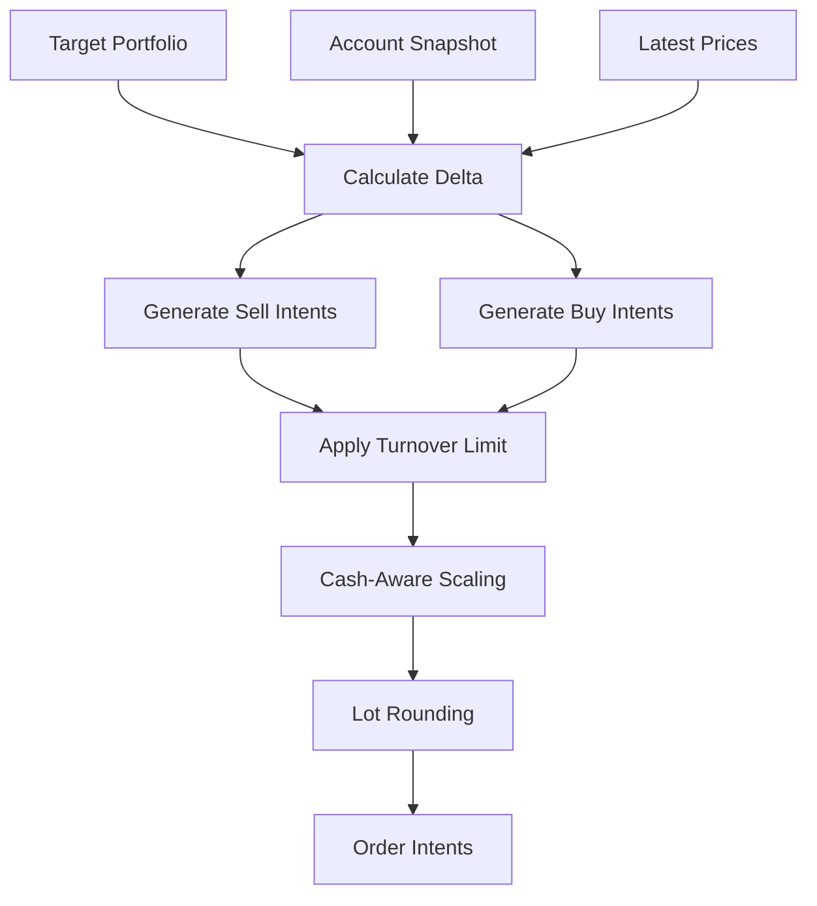

# Order Planner Module Design

## Status

- Scope: converting target portfolios into executable order intents
- Owner: quant-trade maintainers
- Status: active target design
- Last Updated: 2026-05-13

## Goals And Non-Goals

Goals:

- Convert target weights into deterministic order intents.
- Respect A-share lot size, cash, T+1 sellability, turnover, and tradability constraints.
- Explain every generated, scaled, or skipped order.

Non-goals:

- It does not submit orders.
- It does not override risk rejection.
- It does not reconcile actual fills.

## Current State

- Java has `OrderPlanner` and `DefaultOrderPlanner`.
- Planner tests exist for lot-size behavior.
- More rules are needed for turnover, sellable quantities, cash scaling, and limit constraints.

## Target Design



## Core Interfaces And Contracts

```text
OrderPlanner
- plan(signal, account_snapshot, market_data, risk_decision) -> OrderPlan

OrderIntent
- client_order_id
- account_id
- signal_id
- symbol
- side
- quantity
- order_type
- limit_price
- time_in_force
- reason
```

Planning order:

1. Compute target value and current value.
2. Generate sell candidates first.
3. Cap sells by sellable quantity.
4. Generate buy candidates using available cash plus planned sell proceeds when allowed.
5. Apply turnover and order count limits.
6. Round quantities down to board lots.
7. Filter dust orders.

## Data And State Model

`OrderPlan`:

- plan id, signal id, account id, trace id.
- generated intents.
- skipped intents with reasons.
- estimated turnover, estimated cash after plan.
- warnings and applied scaling factor.

## Failure Handling And Security

- If latest price is missing, skip the symbol and explain.
- If quantity rounds to zero, skip rather than create invalid orders.
- If cash is insufficient, scale buys down deterministically.
- Limit-up should block buy; limit-down should block or mark sell as low-confidence depending on execution mode.
- Client order ids must be deterministic enough to support idempotent recovery.

## Tests And Acceptance

- Quantities are multiples of 100.
- Sell quantity never exceeds sellable shares.
- Buy notional never exceeds available cash after buffers.
- Same input produces same plan and client order ids.
- Skipped orders have clear reasons.

## Dependencies

- Consumes Signal, RiskDecision, AccountSnapshot, MarketData.
- Produces OrderPlan for `trade-executor`, `broker-gateway`, ledger, and Web.

## Phased Delivery

1. Strengthen current planner with sellable, cash, and dust-order rules.
2. Add turnover scaling and deterministic client order ids.
3. Persist order plans before broker placement.
4. Add limit and volume participation rules.
