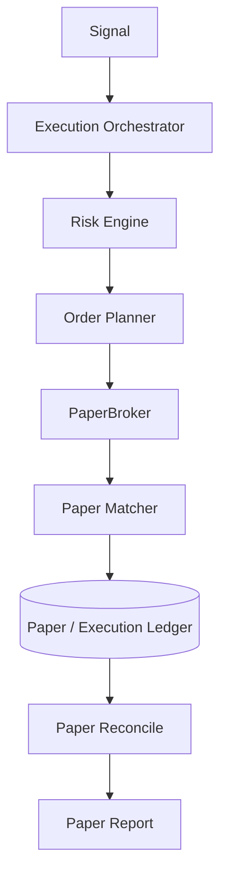
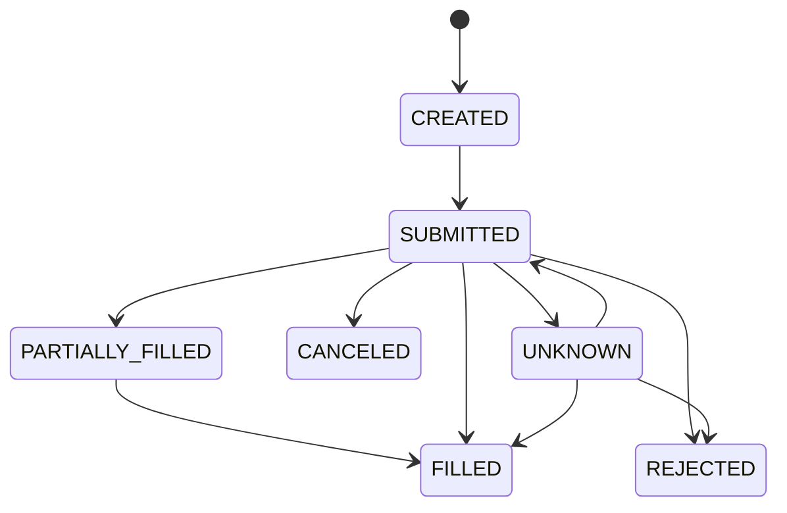

# Paper Trading Module Design

## Status

- Scope: simulated execution, paper broker, paper matcher, paper ledger, and paper reports
- Owner: quant-trade maintainers
- Status: active target design
- Last Updated: 2026-05-13

## Goals And Non-Goals

Goals:

- Rehearse the production execution chain without real broker orders.
- Simulate account cash, positions, orders, fills, and PnL.
- Support realistic order states, partial fills, rejects, unknown statuses, and fault injection.
- Produce audit and reconciliation data like live execution.

Non-goals:

- Paper trading is not a replacement for live-readonly or live-sim.
- Paper matching does not need high-frequency order book realism in early phases.

## Current State

- Python has a daily-bar simulator used by backtest and paper account APIs.
- Java has a `PaperBroker` scaffold.
- Current matching is simplified and immediate.
- Full order state, paper ledger, fault injection, and reconciliation are pending.

## Target Design

## Core Interfaces And APIs

`PaperBroker`:

- `placeOrders(intents)`
- `cancel(clientOrderId)`
- `queryOrders(accountId)`
- `queryPositions(accountId)`
- `queryAccount(accountId)`
- `queryFills(accountId)`

Paper matching modes:

- immediate fill for smoke tests.
- bar-based fill using daily or minute OHLCV.
- volume-limited fill.
- fault-injection mode.

## Data And State Model

Order states:

State includes:

- account cash and frozen cash.
- positions and T+1 sellable quantity.
- orders, order events, fills.
- daily PnL and reconcile status.

## Failure Handling And Security

- Unknown order status must not cause blind duplicate placement.
- Fault injection should be deterministic when seeded.
- Paper and live should share the `ExecutionOrchestrator` so tests exercise the live path.
- Paper should never call real broker APIs.

## Tests And Acceptance

- Duplicate signal execution does not create duplicate paper orders.
- Partial fill, reject, cancel, unknown, and delayed fill tests.
- T+1 and 100-share lot tests.
- Restart recovery and paper reconciliation tests.
- Web can show paper account, orders, fills, PnL, and reconcile state.

## Dependencies

- Consumes signals, risk decisions, order plans, and market data.
- Writes to execution ledger.
- Feeds Web paper and execution views.

## Phased Delivery

1. Strengthen Java PaperBroker as the execution-side paper implementation.
2. Keep Python simulator for research and smoke checks.
3. Add order event state machine and ledger persistence.
4. Add fault injection and multi-day paper reports.
