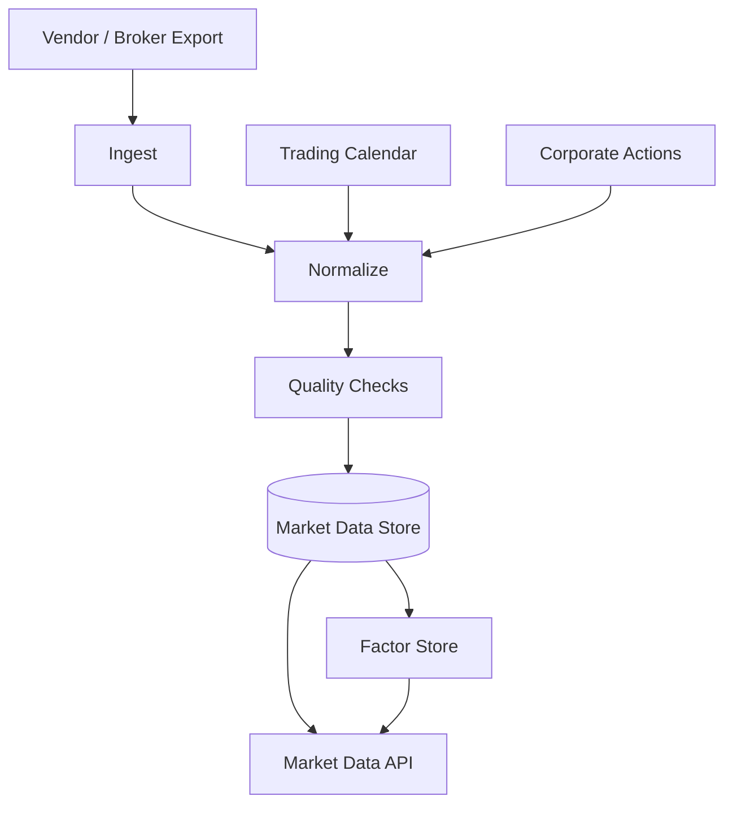

# Quant Data Module Design

## Status

- Scope: future `quant-data` data platform
- Owner: quant-trade maintainers
- Status: target design
- Last Updated: 2026-05-13

## Goals And Non-Goals

Goals:

- Own normalized market, calendar, instrument, factor, and data quality datasets.
- Make every strategy, backtest, signal, and execution decision traceable to `data_version`.
- Encode A-share market realities such as ST, suspension, limit up/down, lifecycle, and lot size.
- Serve both batch research and operational APIs.

Non-goals:

- It does not decide trades.
- It does not call broker trading APIs.
- It does not replace the execution ledger.

## Current State

- Local CSV market samples live under `quant-research/data/market`.
- Python `CsvMarketDataProvider` reads instruments and daily bars.
- No standalone `quant-data` root module exists yet.
- Data quality reports, calendars, factors, and vendor ingestion are pending.

## Target Design



The first production version should keep `quant-data` as a separate module only when ingestion and quality checks exceed the CSV provider's responsibilities.

## Core Interfaces And APIs

Candidate APIs:

- `GET /api/v1/instruments`
- `GET /api/v1/bars/daily?symbol=&start=&end=&data_version=`
- `GET /api/v1/calendar?exchange=&year=`
- `GET /api/v1/factors?symbol=&factor=&date=`
- `GET /api/v1/data-quality/latest`

Provider interface:

```text
MarketDataProvider
- list_instruments()
- get_daily_bars(symbol, start, end, data_version)
- get_calendar(exchange, start, end)
- get_data_status()
```

## Data And State Model

- `Instrument`: symbol, name, asset type, exchange, industry, lifecycle dates, lot size, tags.
- `DailyBar`: OHLCV, amount, pre-close, adj factor, adj close, suspension, limit flags, ST flag, data version.
- `TradingCalendar`: exchange, trading date, open flag, sessions.
- `CorporateAction`: symbol, ex-date, action type, factor, cash dividend, stock dividend.
- `DataQualityReport`: data version, checks run, failures, warnings, created time.

Storage target:

- PostgreSQL for metadata, quality reports, and indexes.
- Parquet for daily/minute bars and factor snapshots.
- Redis only for latest quote style low-latency reads when needed.

## Failure Handling And Security

- If a data quality check fails, downstream strategy runs must record the failure or refuse the data version.
- Missing bars, duplicate bars, bad price ranges, bad volume/amount, calendar mismatch, and lifecycle mismatch must be explicit checks.
- Vendor credentials must remain outside repo-tracked files.
- Data ingestion must preserve raw import audit references for later investigation.

## Tests And Acceptance

- Golden CSV/Parquet samples validate normalization.
- Data quality tests cover missing, duplicate, invalid price, suspension, limit, and lifecycle cases.
- Backtest and signal outputs include the selected data version.
- Web can show latest data date, quality status, and failed checks.

## Dependencies

- `quant-research` consumes normalized bars, factors, and analysis inputs.
- `risk-engine` consumes tradability tags for live checks.
- `web-console` displays data state and quality reports.

## Phased Delivery

1. Extend current CSV provider with calendars, tags, and quality reports.
2. Introduce `data_version` in research and signal outputs.
3. Create `quant-data` module when ingestion and normalization become first-class workflows.
4. Add Parquet/PostgreSQL storage and factor snapshots.
