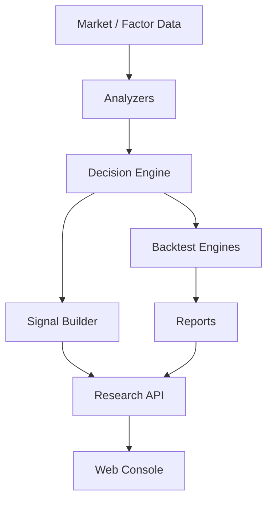

# Quant Research Module Design

## Status

- Scope: Python research, backtest, paper simulation, signal generation, and research API
- Owner: quant-trade maintainers
- Status: active target design
- Last Updated: 2026-05-13

## Goals And Non-Goals

Goals:

- Support strategy research, factor analysis, market and stock analysis, backtesting, signal generation, and Web-facing research APIs.
- Keep strategies explainable and deterministic for the same inputs.
- Publish target-portfolio signals only through contracts.
- Share strategy output between backtest, paper trading, and signal service.

Non-goals:

- Python research does not place real broker orders.
- It does not own production execution idempotency.
- It does not replace Java execution risk checks.

## Current State

- FastAPI exposes health, version, signal, explanation, overview, market bars, strategy, backtest, paper, and signal endpoints.
- SQLite stores local research and paper snapshots.
- CSV provider reads bundled daily market data.
- Backtest and paper share a daily-bar simulator.
- Web MVP lives under `quant-research/web`.

## Target Design



Target packages:

- `analyzers`: market regime, breadth, sector, technical, fundamental, liquidity.
- `factors`: momentum, volatility, valuation, quality, growth, liquidity.
- `strategies`: versioned strategy definitions.
- `decision`: score model, risk budget, target portfolio builder.
- `backtest`: requests, results, metrics, reports.
- `engines`: smoke and external adapters.
- `signal`: builder, validator, explainer, publisher.
- `serve`: route modules grouped by resource.

## Core Interfaces And APIs

Strategy interface:

```text
Strategy
- strategy_id
- strategy_version
- analyze(context) -> AnalysisResult
- decide(context, analysis) -> TargetPortfolio
- explain(context, decision) -> StrategyExplanation
```

Research APIs:

- Current MVP APIs remain under `/api/v1`.
- New analysis APIs add market and stock analysis.
- Signal generation should move from ad hoc latest signal to explicit generate, validate, publish, and latest-published reads.

## Data And State Model

- `StrategyRun`: strategy version, trading date, data version, targets, explanation.
- `BacktestRun`: request, engine type, data version, metrics, curves, orders, fills, positions.
- `AnalysisResult`: market regime, stock scores, rejected symbols, factor contributions.
- `Signal`: contract payload, checksum, idempotency key, status.

SQLite can remain local MVP storage. PostgreSQL becomes the target for shared research history when multiple services or users depend on it.

## Failure Handling And Security

- Reject strategy runs when requested data is missing or quality failed.
- Signal generation must exclude or mark untradable symbols before publishing.
- Public APIs keep the project envelope shape: `success`, `data`, `error`, `meta`.
- API inputs should be Pydantic-validated at boundary routes.

## Tests And Acceptance

- Unit tests cover providers, strategies, analyzers, decisions, signal builder, and checksum.
- Integration tests cover `/api/v1/*` endpoints.
- Golden data tests keep backtest and paper outputs stable.
- Strategy outputs record `strategy_version` and `data_version`.
- Research code keeps 80%+ coverage.

## Dependencies

- Consumes `contracts` and `quant-data`.
- Produces signals for `trade-executor`.
- Feeds Web Console research and signal views.

## Phased Delivery

1. Fix signal idempotency and add strategy/data version fields.
2. Split FastAPI routes by resource as endpoints grow.
3. Add market and stock analyzers.
4. Add backtest adapter interface and one external adapter.
5. Move Web to root `web-console` only when it spans execution and operations.
