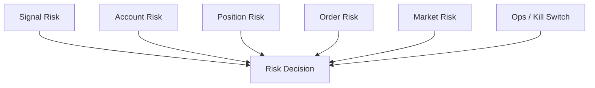

# Risk Engine Module Design

## Status

- Scope: pre-trade risk checks, kill switch checks, approval requirements, and risk decisions
- Owner: quant-trade maintainers
- Status: active target design
- Last Updated: 2026-05-13

## Goals And Non-Goals

Goals:

- Block unsafe signals and orders before broker placement.
- Explain every rejection.
- Support account, position, order, market, and ops risk rules.
- Make risk decisions auditable and replayable.

Non-goals:

- It does not generate target portfolios.
- It does not mutate broker state.
- It does not replace post-trade reconciliation.

## Current State

- Java has `RiskEngine` and `DefaultRiskEngine`.
- Tests cover basic risk behavior.
- Current rules are intentionally small.
- Kill switch and richer market/account risk are pending.

## Target Design



## Core Interfaces And Contracts

```text
RiskEngine
- evaluate(signal, account_snapshot, order_candidates, risk_context) -> RiskDecision

RiskDecision
- approved
- severity
- messages
- rejected_rules
- allowed_turnover_pct
- require_manual_approval
- kill_switch_active
```

Rule categories:

- schema and checksum.
- idempotency and signal freshness.
- max single position and sector exposure.
- cash and buying power.
- T+1 sellability.
- blacklist, ST, suspension, delist, limit-up/down.
- turnover and order count.
- daily loss, drawdown, kill switch, manual approval.

## Data And State Model

Risk decisions are stored with:

- run id, signal id, idempotency key, account id.
- approved flag, severity, rule results.
- raw normalized inputs references.
- created time and trace id.

Risk config should be versioned so historical decisions can be replayed.

## Failure Handling And Security

- Missing account snapshot in live mode should reject.
- Missing market state for tradability should reject or require manual approval.
- Kill switch has highest priority.
- Error messages must be actionable but must not expose secrets or raw broker credentials.

## Tests And Acceptance

- Tests for every risk rule.
- Kill switch test proves broker placement is not called.
- Risk config versioning test.
- Replay test reproduces the same decision from stored inputs.
- Web can show rejected rules and messages.

## Dependencies

- Consumes contracts, account snapshots, market/stock analysis, order candidates, kill switch state.
- Feeds `trade-executor`, `execution-ledger`, `web-console`, and alerting.

## Phased Delivery

1. Expand current Java rule set for signal, cash, lot, T+1, and single-position checks.
2. Add kill switch and manual approval outputs.
3. Persist risk decisions.
4. Add market/stock analyzer driven risk rules.
