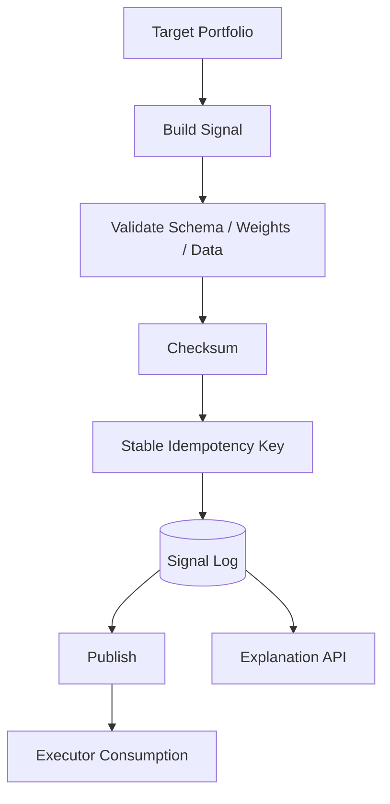

# Signal Service Module Design

## Status

- Scope: signal generation, validation, publication, explanation, and audit
- Owner: quant-trade maintainers
- Status: active target design
- Last Updated: 2026-05-13

## Goals And Non-Goals

Goals:

- Convert strategy decisions into standardized target-portfolio signals.
- Validate schema, weights, constraints, checksum, data version, and tradability.
- Generate stable idempotency keys.
- Store, explain, and publish signals for execution and Web inspection.

Non-goals:

- It does not submit broker orders.
- It does not decide final execution quantities.
- It does not replace execution-side risk.

## Current State

- Python `SignalService` can create a latest target-portfolio signal.
- Signals are exposed through `/signal` and `/api/v1/signals`.
- Research repository stores signal payloads in SQLite.
- Signal v1 idempotency is time-based and should move to a stable trading-cycle key.

## Target Design



## Core Interfaces And APIs

APIs:

- `POST /api/v1/signals/generate`
- `POST /api/v1/signals/{signal_id}/validate`
- `POST /api/v1/signals/{signal_id}/publish`
- `GET /api/v1/signals/latest?account_id=`
- `GET /api/v1/signals/{signal_id}`
- `GET /api/v1/signals/{signal_id}/explain`

Signal lifecycle:

```text
GENERATED -> VALIDATED -> APPROVED -> PUBLISHED -> CONSUMED -> EXECUTED
                                |-> REJECTED
                       PUBLISHED -> EXPIRED / CANCELED
```

## Data And State Model

`signal_log` target fields:

- signal id, account id, strategy id, strategy version.
- trading date, rebalance cycle, data version.
- status and timestamps.
- payload JSON, checksum, idempotency key.
- validation errors and explanation references.

Signal v2 idempotency:

```text
strategy_id + strategy_version + account_id + trading_date + rebalance_cycle
```

## Failure Handling And Security

- Never publish invalid schema or overweight signals.
- Do not allow stale or expired signals to be consumed.
- Exclude or explain untradable symbols before publishing.
- Checksum must be stable and verifiable by Java before risk checks.
- Error payloads should not leak raw vendor or account-sensitive data.

## Tests And Acceptance

- Same strategy/account/date/cycle produces one effective idempotency key.
- Checksum mismatch is rejected.
- Overweight, missing data version, stale trading date, and invalid status tests.
- Executor can fetch only latest published signal.
- Web can show status, targets, constraints, checksum, and explanation.

## Dependencies

- Consumes `contracts`, `decision-engine`, and market data status.
- Produces signals for `trade-executor`.
- Feeds Web Signal and execution trace views.

## Phased Delivery

1. Add Signal v2 fields and stable idempotency while retaining v1 compatibility tests.
2. Add signal status and publish flow.
3. Move SQLite signal history toward PostgreSQL when execution consumes it directly.
4. Add expiration, approval, and audit events before live phases.
