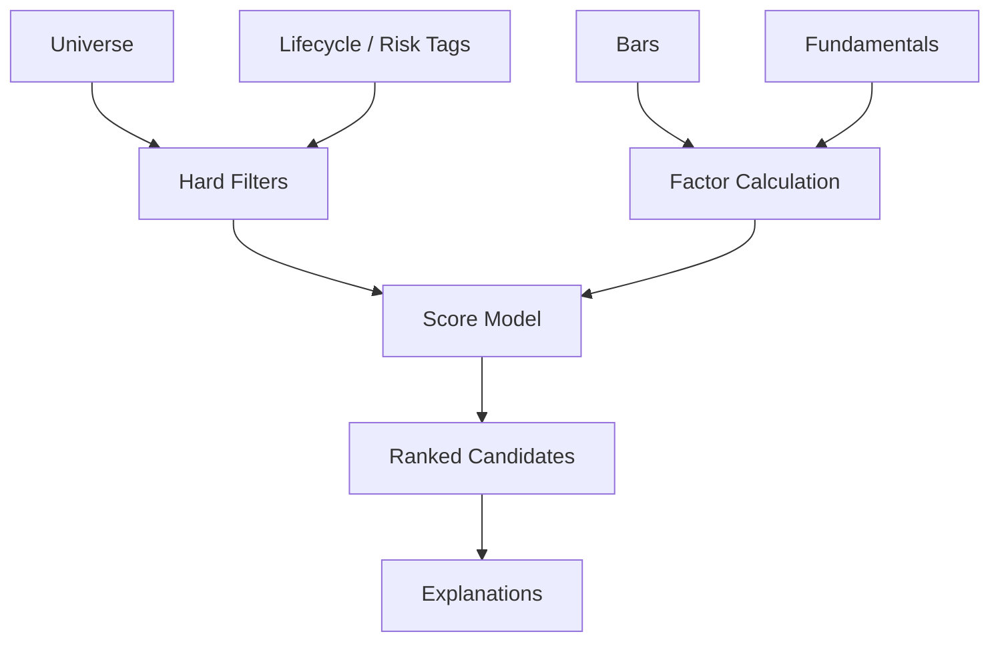

# Stock Analyzer Module Design

## Status

- Scope: stock scoring, filtering, ranking, and explanations
- Owner: quant-trade maintainers
- Status: target design
- Last Updated: 2026-05-13

## Goals And Non-Goals

Goals:

- Build an explainable candidate pool for strategy decisions.
- Filter untradable or unsafe stocks before portfolio construction.
- Provide multi-factor scores for momentum, valuation, quality, growth, liquidity, and risk.

Non-goals:

- It does not decide final portfolio weights.
- It does not bypass strategy or risk controls.

## Current State

- No dedicated stock analyzer exists.
- Current MVP uses a small static universe from local CSV instruments.
- Tradability flags exist on market bars, but ST, delist, industry, and fundamental data are not modeled yet.

## Target Design



## Core Interfaces And APIs

Analyzer interface:

```text
StockAnalyzer
- analyze_universe(trading_date, universe, data_version) -> list[StockAnalysis]
- analyze_symbol(symbol, trading_date, data_version) -> StockAnalysis
```

API:

- `GET /api/v1/stocks/{symbol}/analysis`
- `GET /api/v1/stock-analysis?trading_date=&universe=`

## Data And State Model

`StockAnalysis`:

- symbol, trading date, data version.
- tradable flag and rejection reasons.
- score and rank.
- factor scores: momentum, quality, valuation, growth, liquidity, volatility risk.
- risk flags: ST, suspended, delisting, low liquidity, blacklisted, financial anomaly.
- suggestion: `candidate`, `hold`, `reduce`, `avoid`.
- explanation list.

Hard filters:

- ST and delisting tags.
- current suspension.
- insufficient average daily amount.
- too-new listing if configured.
- blacklisted symbols.
- current non-tradable state.

## Failure Handling And Security

- Missing required price history should reject the symbol with a reason.
- Missing optional fundamentals should reduce confidence, not silently score as neutral unless configured.
- Factor calculations must avoid look-ahead bias by using only data available at the trading date.
- External data imports must not store credentials in result payloads.

## Tests And Acceptance

- Golden scoring cases for selected symbols.
- Tests for every hard filter.
- Look-ahead guard tests for factor windows.
- Web can show selected and rejected symbols with explanations.

## Dependencies

- Consumes `quant-data` bars, tags, fundamentals, and factor inputs.
- Feeds `decision-engine`, `backtest-engine`, and `web-console`.
- Rejection tags are also useful for `risk-engine`.

## Phased Delivery

1. Implement tradability and liquidity filters.
2. Add technical momentum, volatility, and liquidity scores.
3. Add fundamentals and industry-aware scoring.
4. Persist stock analysis snapshots for replay.
