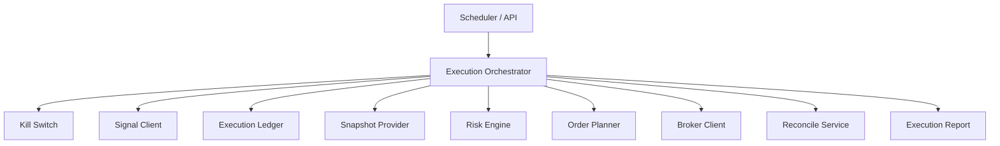

# Trade Executor Module Design

## Status

- Scope: Java execution workflow, orchestration, risk, planning, broker calls, ledger, and reconciliation
- Owner: quant-trade maintainers
- Status: active target design
- Last Updated: 2026-05-13

## Goals And Non-Goals

Goals:

- Consume published signals and execute them idempotently.
- Enforce kill switch, risk checks, order planning, broker submission, ledger recording, and reconciliation.
- Recover safely after process restart or broker uncertainty.
- Produce execution reports and operator-visible state.

Non-goals:

- It does not generate strategy decisions.
- It does not own raw market-data ingestion.
- It does not embed broker SDK-specific behavior once broker gateway exists.

## Current State

- Java package has `client`, `risk`, `planner`, `broker`, `ledger`, `reconcile`, and `core`.
- `ExecutionOrchestrator.runOnce(accountId)` is the main workflow skeleton.
- In-memory ledger exists; PostgreSQL-backed ledger is pending.
- `HttpSignalClient` and deeper broker state handling are pending.

## Target Design

## Core Interfaces And APIs

Executor API:

- `POST /api/v1/execution/run-once`
- `GET /api/v1/execution/runs/{run_id}`
- `GET /api/v1/orders`
- `GET /api/v1/fills`
- `GET /api/v1/positions`
- `GET /api/v1/reconcile/latest`
- `POST /api/v1/kill-switch/enable`
- `POST /api/v1/kill-switch/disable`

Executor APIs use the project response envelope: `success`, `data`, `error`, and `meta`.

Core flow:

1. Check kill switch.
2. Fetch latest published signal.
3. Validate checksum and contract.
4. Check idempotency key.
5. Create execution run.
6. Load account snapshot.
7. Run risk.
8. Plan orders.
9. Persist plan.
10. Submit orders.
11. Persist broker order ids and events.
12. Query fills and positions.
13. Reconcile.
14. Mark processed.

## Data And State Model

`ExecutionReport`:

- account id, signal id, idempotency key, status.
- risk decision, planned/submitted/filled/rejected counts.
- reconciliation status.
- start and finish timestamps.
- trace id.

Execution states:

- `STARTED`, `RISK_REJECTED`, `PLANNED`, `SUBMITTED`, `PARTIAL`, `COMPLETED`, `FAILED`, `RECOVERING`, `CANCELED`.

## Failure Handling And Security

- If the idempotency key was already processed, return the previous result without broker placement.
- If broker returns unknown, persist unknown and reconcile before retrying placement.
- Risk rejection must be final for that run unless a new approved signal is published.
- Live mode checks kill switch before any new opening order.
- Broker raw payloads must be logged safely without credentials.

## Tests And Acceptance

- Duplicate signal execution does not duplicate broker calls.
- Restart recovery resumes or reconciles unfinished orders.
- Kill switch blocks live placement.
- Risk rejection writes ledger records and skips broker.
- Unknown broker status does not blindly resubmit.

## Dependencies

- Consumes `contracts/signal`, signal service APIs, account snapshots, market data, and broker APIs.
- Owns execution ledger and reconciliation workflow.
- Feeds Web Console and observability.

## Phased Delivery

1. Implement `HttpSignalClient`.
2. Implement `JdbcExecutionLedger`.
3. Add execution API and reports.
4. Move broker-specific operations behind broker gateway.
5. Add scheduler and live-mode gates.
