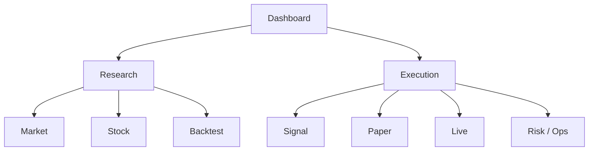

# Web Console Module Design

## Status

- Scope: Web UI for research, backtest, paper, live, risk, operations, and approvals
- Owner: quant-trade maintainers
- Status: active target design
- Last Updated: 2026-05-13

## Goals And Non-Goals

Goals:

- Give researchers and operators one place to inspect system state.
- Show data, strategies, backtests, signals, paper/live accounts, orders, fills, reconciliation, risk, and alerts.
- Support manual approval and kill switch operations in later phases.
- Make every execution traceable from signal to order to fill.

Non-goals:

- Web does not directly call broker SDKs.
- Web does not bypass API validation or audit logs.
- Early Web MVP does not need multi-tenant SaaS features.

## Current State

- A React/Vite Web MVP exists under `quant-research/web`.
- It displays overview, market data, strategies/backtests, paper trading, and signals.
- It is a local research tool with no auth.
- It does not yet show Java execution ledger, risk decisions, broker states, or kill switch controls.

## Target Design

Short-term: keep Web inside `quant-research/web`.

Long-term: move to root-level `web-console` when it becomes a cross-service console for Research, Executor, Broker Gateway, and Ops.

## Core Interfaces And APIs

Web consumes:

- Research APIs for market data, analysis, strategies, backtests, and signals.
- Executor APIs for execution runs, orders, fills, positions, risk decisions, reconciliation, and kill switch.
- Broker Gateway readonly APIs for live account views when available.
- Observability APIs or dashboards for health and alerts.

Key pages:

- Dashboard.
- Market and Stock.
- Research and Backtest.
- Signal.
- Paper.
- Live.
- Risk/Ops.
- Incident replay.

## Data And State Model

UI state should be resource-oriented:

- selected account.
- selected trading date.
- selected strategy version.
- selected signal or execution run.
- selected mode: dev, paper, readonly, live-sim, live-small, live.

Audit-sensitive actions:

- publish signal.
- approve execution.
- enable or disable kill switch.
- switch live modes.

## Failure Handling And Security

- Live actions require explicit confirmation and audit records.
- Display stale data and API errors clearly.
- Do not expose secrets or raw credentials in UI.
- Kill switch must remain reachable even if non-critical pages fail.
- Auth can be omitted for local MVP, but live phases require authentication and authorization.

## Tests And Acceptance

- Unit tests for API client and core pages.
- E2E tests for overview, market, backtest, signal, paper, and execution trace.
- Error and empty states for all pages.
- Later live-phase tests for approval and kill switch flows.
- Visual checks ensure dense operational UI remains readable.

## Dependencies

- Consumes APIs from `quant-research`, `trade-executor`, `broker-gateway`, and observability.
- Displays contracts but does not own them.

## Phased Delivery

1. Continue improving `quant-research/web` for research and paper MVP.
2. Add execution chain pages from Java ledger APIs.
3. Add risk, reconcile, and alert views.
4. Promote to root `web-console` when it spans multiple services.
5. Add auth, approval, audit, and live controls.
