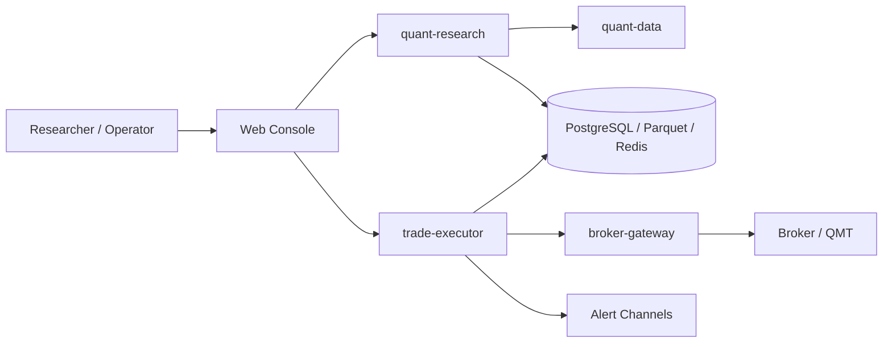
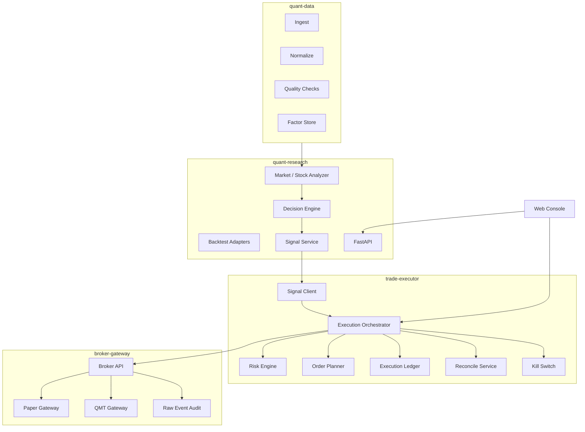

# Target Architecture

## Status

- Scope: end-state architecture for `quant-trade`
- Owner: quant-trade maintainers
- Status: active
- Last Updated: 2026-05-13

## Goal

Build `quant-trade` into an A-share quant trading platform where research can be verified, signals can be explained, execution can be controlled, trades can be audited, failures can be recovered, and live trading can be stopped quickly.

The platform should stay self-owned at the business boundary:

- Data governance, signal contracts, risk, execution, ledger, broker gateway, reconciliation, Web Console, and observability are platform responsibilities.
- External open-source engines may be used behind adapters for backtesting, analytics, or optimization.
- Strategies never call broker APIs directly.

## Context

## Containers

## End-To-End Data Flow

```mermaid
flowchart LR
    Raw[Raw Data] --> DataQuality[Normalize + Quality]
    DataQuality --> Analysis[Market / Stock Analysis]
    Analysis --> Decision[Decision Engine]
    Decision --> Signal[Validated Signal]
    Signal --> Executor[Execution Run]
    Executor --> Risk[Risk Decision]
    Risk --> Plan[Order Plan]
    Plan --> Broker[Broker Gateway]
    Broker --> Events[Order / Fill Events]
    Events --> Ledger[Execution Ledger]
    Ledger --> Reconcile[Reconcile]
    Reconcile --> Report[Web / Alert / Replay]
```

## Environment Gates

| Environment | Purpose | Allows | Blocks | Promotion Condition |
|---|---|---|---|---|
| `dev` | Local development | Unit and API tests | Real account access | Tests pass |
| `backtest` | Historical validation | Strategy and adapter runs | Broker calls | Stable reproducible results |
| `paper` | Simulated execution | Paper broker and ledger | Real orders | Multi-day stable paper runs |
| `live-readonly` | Real account observation | Query account, positions, orders, fills | Place or cancel orders | Readonly reconciliation is stable |
| `live-sim` | Real snapshot simulation | Simulated orders using real snapshots | Real orders | Fault injection and recovery pass |
| `live-small` | Limited live trading | Whitelisted small orders with approval | Large or unapproved orders | Stable operation and reconciliation |
| `live` | Controlled automation | Scheduled execution with kill switch | Trading without guardrails | Long-term stability |

## Public Boundaries

- `contracts` owns JSON schemas and examples for cross-language payloads.
- `quant-research` owns research APIs, signal generation, and Web-facing research data.
- `trade-executor` owns idempotent execution, risk, planning, ledger, and reconciliation.
- `broker-gateway` owns broker SDK isolation, mode guards, readonly and live broker operations.
- `web-console` owns operator visibility and approvals.

## Safety Invariants

- A strategy output is not executable until it becomes a validated and published signal.
- A signal cannot be executed twice for the same idempotency key.
- Risk rejection must be recorded and must not call broker placement APIs.
- Kill switch must be checked before any new live order.
- Broker unknown status must not trigger blind re-submission.
- Every order and fill must be traceable to `signal_id`, `idempotency_key`, and `trace_id`.
