# quant-trade 终极设计方案

> 版本：v1.0  
> 日期：2026-05-13  
> 目标读者：项目维护者、量化策略开发者、后端执行系统开发者、风控/运维负责人  
> 当前定位：基于现有 `quant-trade` 仓库演进，而不是推倒重来。

---

## 0. 总结结论

`quant-trade` 的最佳路线不是“完全自研一个量化框架”，也不是“直接替换成某个开源量化框架”，而是：

> **自研量化交易平台 + 可插拔开源研究/回测引擎 + 自研风控执行账本 + 独立 Broker Gateway。**

最终系统应成为一个可以覆盖以下能力的完整量化交易软件：

1. **研究**：支持 Notebook、策略实验、因子分析、市场/个股分析。
2. **回测**：支持多策略、多参数、多时间窗口、A 股交易规则、回测报告、结果归档。
3. **纸交易**：支持模拟账户、模拟订单、模拟成交、模拟持仓、模拟 PnL、回放验证。
4. **信号服务**：支持策略生成目标组合信号、信号校验、幂等、版本、解释、审计、发布。
5. **行情分析**：支持指数趋势、市场宽度、成交额、行业轮动、波动率、风险状态。
6. **个股分析**：支持技术面、基本面、估值、质量、成长、流动性、风险、标签过滤。
7. **决策**：支持因子打分、组合优化、风险预算、仓位控制、解释性输出。
8. **自动真实交易**：支持信号消费、风控、订单规划、真实 Broker 接入、订单状态跟踪、成交回报、对账、熔断、Kill Switch。
9. **平台治理**：支持策略版本、任务调度、权限、审计、日志、监控、告警、回滚、事故回放。

核心原则：

```text
策略不直接下单。
策略只产生信号。
执行器只消费已验证信号。
真实下单前必须经过风控、订单规划、账本记录和 Kill Switch 检查。
```

---

## 1. 当前仓库定位与演进判断

当前仓库已经具备正确的方向：

```text
quant-trade
├── contracts/signal
├── quant-research
├── trade-executor
├── infra
├── scripts
└── docs
```

现阶段可以理解为：

```text
MVP Scaffold
= Python 研究/信号原型
+ Java 执行/风控/订单原型
+ Signal Contract
+ Paper/QMT Adapter 骨架
+ PostgreSQL Ledger 表结构草案
+ Docker Compose 本地环境
```

需要保留的资产：

| 资产 | 是否保留 | 原因 |
|---|---:|---|
| `contracts/signal` | 是 | Python 与 Java 的核心边界，后续所有交易决策都通过它传递 |
| `quant-research` | 是 | 继续作为研究、回测、分析、信号生成服务 |
| `trade-executor` | 是 | 继续作为风控、订单规划、执行、对账和账本系统 |
| `Broker` 抽象 | 是 | Paper、QMT、未来其他券商接口都应通过统一抽象接入 |
| `ExecutionOrchestrator` | 是 | 当前流程方向正确，应增强而不是删除 |
| `RiskEngine` | 是 | 当前规则少，但抽象方向正确 |
| `OrderPlanner` | 是 | 应升级为 A 股交易规则完整的订单规划器 |
| Flyway SQL | 是 | 应升级成生产级执行账本 |
| Web 工作台 | 是 | 后续升级成完整 Web Console |

不建议继续扩大为“纯自研量化框架”的部分：

| 模块 | 当前问题 | 推荐处理 |
|---|---|---|
| 日线回测引擎 | 适合 smoke test，不适合长期完整回测 | 改成 `DailyBarSmokeEngine`，并接入开源回测引擎 Adapter |
| 简单纸交易 simulator | 立即成交，缺少订单状态机 | 拆分为 PaperBroker、PaperLedger、PaperMatcher |
| 静态分配策略 | 不是完整行情/个股分析 | 保留为 baseline，新增 Analyzer 与 Decision Engine |
| 内存执行账本 | 重启丢失，不可生产 | 实现 `JdbcExecutionLedger` |
| QMT Broker scaffold | 尚未真实下单/查询 | 独立成 `broker-gateway` 服务逐步接入 |
| 当前信号幂等 | 基于当前时间生成，容易重复 | 改为交易日/周期/策略版本稳定幂等键 |

---

## 2. 终极设计目标

### 2.1 产品目标

最终软件应具备以下体验：

```text
用户打开 Web Console
  ↓
查看行情、指数、行业、个股分析
  ↓
创建或选择策略
  ↓
运行回测
  ↓
查看回测报告与风险指标
  ↓
启动纸交易
  ↓
连续验证策略稳定性
  ↓
进入 live-readonly 读取真实账户
  ↓
进入 live-sim 模拟真实执行
  ↓
小额实盘
  ↓
全自动实盘
```

### 2.2 工程目标

最终系统必须满足：

1. **可解释**：每个信号都有原因、置信度、数据版本和策略版本。
2. **可审计**：信号、风控、订单、成交、持仓、PnL、对账结果全链路入库。
3. **可回放**：任意一次信号执行可以用历史数据和账户快照重放。
4. **可熔断**：出现异常行情、亏损、下单失败、对账不一致时自动停止。
5. **可降级**：live 可降级到 live-readonly / paper，不影响研究和回测。
6. **可插拔**：研究/回测引擎可替换，Broker 接口可替换。
7. **可测试**：单测、集成测试、回放测试、故障注入测试、端到端测试。
8. **不重复下单**：幂等机制、订单状态机、账本恢复保证重复执行不重复报单。

### 2.3 非目标

第一阶段不做：

- 高频交易。
- 毫秒级撮合。
- 期权、期货、融资融券复杂品种。
- 多租户 SaaS 收费平台。
- 全自动无人监管大资金实盘。
- 跨境多市场统一交易。

后续可以扩展，但不要在第一版里引入过多复杂度。

---

## 3. 总体架构

### 3.1 C4 Context 图

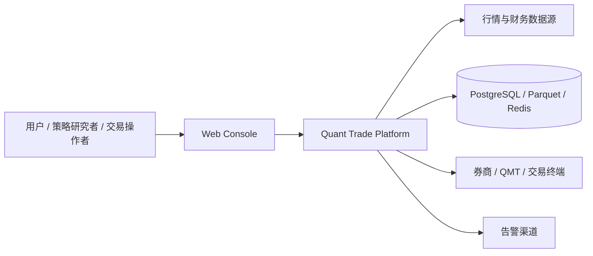

### 3.2 Container 架构图

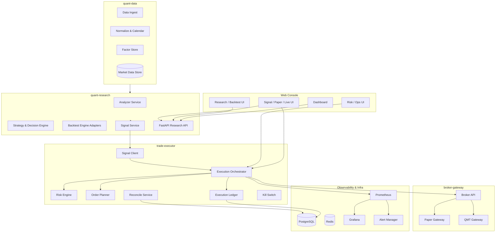

### 3.3 关键数据流


### 3.4 信号到执行时序图

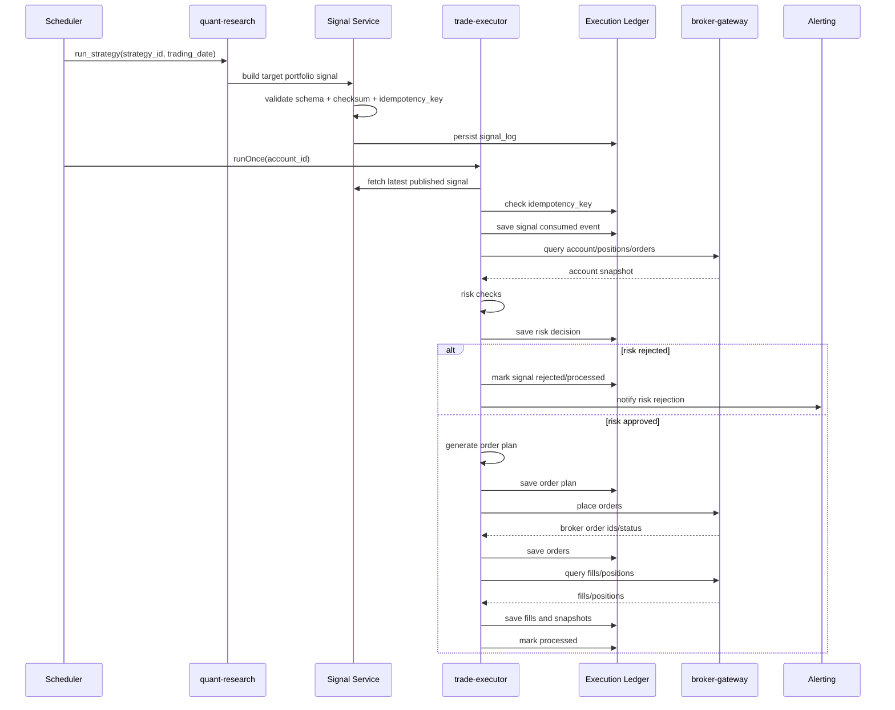

---

## 4. 环境分层与准入

### 4.1 环境状态机

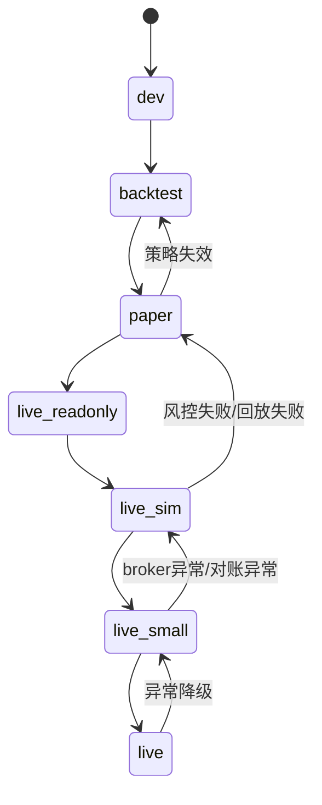

### 4.2 各环境目标

| 环境 | 目标 | 允许 | 禁止 | 晋级条件 |
|---|---|---|---|---|
| `dev` | 本地开发验证 | 单测、接口测试 | 接真实账户 | 单测通过 |
| `backtest` | 历史验证 | 多参数、多时间窗口回测 | 实盘下单 | 回测指标达标，数据质量通过 |
| `paper` | 模拟执行 | PaperBroker、模拟成交 | 真实报单 | 连续 N 日无重大异常 |
| `live-readonly` | 真实账户只读 | 查资金、持仓、订单、成交 | 下单、撤单 | 连续 N 日对账一致 |
| `live-sim` | 真实接口模拟 | 用真实账户快照模拟订单 | 真实报单 | 故障注入通过 |
| `live-small` | 小额实盘 | 白名单、小金额、人工审批 | 大资金、全自动 | 连续 N 日稳定 |
| `live` | 自动实盘 | 自动执行、自动对账 | 无 Kill Switch 的执行 | 长期稳定、风控完备 |

---

## 5. 推荐目标仓库结构

```text
quant-trade
├── contracts
│   ├── signal
│   ├── execution
│   ├── marketdata
│   └── broker
│
├── quant-data
│   ├── ingest
│   ├── normalize
│   ├── calendar
│   ├── corporate_actions
│   ├── factors
│   ├── storage
│   └── quality
│
├── quant-research
│   ├── analyzers
│   ├── factors
│   ├── strategies
│   ├── decision
│   ├── backtest
│   ├── engines
│   ├── paper
│   ├── signal
│   ├── notebooks
│   └── serve
│
├── trade-executor
│   ├── app
│   ├── signal
│   ├── account
│   ├── risk
│   ├── planner
│   ├── broker
│   ├── ledger
│   ├── reconcile
│   └── ops
│
├── broker-gateway
│   ├── api
│   ├── paper
│   ├── qmt
│   ├── simulator
│   ├── mapper
│   └── heartbeat
│
├── web-console
│   ├── dashboard
│   ├── research
│   ├── backtest
│   ├── market
│   ├── stock
│   ├── signal
│   ├── paper
│   ├── live
│   └── risk
│
├── infra
│   ├── docker-compose.yml
│   ├── prometheus
│   ├── grafana
│   ├── alertmanager
│   ├── postgres
│   └── deployment
│
├── scripts
└── docs
    ├── architecture
    ├── operations
    ├── references
    └── standards
```

---

# 6. 模块设计

---

## 6.1 `contracts`：跨模块契约中心

### 设计目标

`contracts` 是整个系统的稳定边界。所有跨语言、跨服务、跨进程通信都应先定义 contract，再写实现。

核心目标：

1. 保证 Python 研究侧和 Java 执行侧对信号的理解一致。
2. 保证 broker-gateway 与 trade-executor 对订单、成交、账户快照的理解一致。
3. 保证 Web Console 调用 API 时有明确的数据结构。
4. 支持版本化升级，避免服务间隐式耦合。

### 子模块

```text
contracts
├── signal
│   ├── signal.schema.json
│   ├── examples
│   └── README.md
├── execution
│   ├── order_intent.schema.json
│   ├── order_event.schema.json
│   └── execution_report.schema.json
├── marketdata
│   ├── market_bar.schema.json
│   ├── quote.schema.json
│   └── instrument.schema.json
└── broker
    ├── account_snapshot.schema.json
    ├── broker_order.schema.json
    ├── broker_fill.schema.json
    └── broker_position.schema.json
```

### 详细设计

#### Signal Contract

信号应以“目标组合”为核心，而不是直接买卖指令。

```json
{
  "schema_version": "1.0.0",
  "signal_id": "sig-20260513-stock_factor_rank-v3-acct-main-a",
  "account_id": "acct-main-a",
  "trading_date": "2026-05-13",
  "as_of": "2026-05-13T15:30:00+08:00",
  "strategy_id": "stock_factor_rank",
  "strategy_version": "v3",
  "rebalance_cycle": "DAILY_CLOSE",
  "universe": ["510300.SH", "600519.SH"],
  "portfolio": {
    "cash_target_pct": 0.15,
    "targets": [
      {
        "symbol": "510300.SH",
        "target_pct": 0.30,
        "confidence": 0.82,
        "reason": "market_regime_positive"
      }
    ]
  },
  "constraints": {
    "max_turnover_pct": 0.18,
    "max_single_position_pct": 0.40,
    "max_daily_loss_pct": 0.01,
    "max_drawdown_pct": 0.08,
    "min_avg_daily_amount": 200000000,
    "exclude_tags": ["ST", "退市", "停牌"]
  },
  "data_version": "daily-bars-20260513-v1",
  "checksum": "sha256:...",
  "idempotency_key": "stock_factor_rank|v3|acct-main-a|2026-05-13|DAILY_CLOSE"
}
```

#### 幂等键规则

```text
idempotency_key =
strategy_id + strategy_version + account_id + trading_date + rebalance_cycle
```

不要用当前时间直接作为幂等键，因为执行器多次拉取信号时可能生成多个新信号，导致重复下单风险。

#### Contract 测试

每个 contract 必须具备：

1. JSON Schema。
2. 正例 example。
3. 反例 invalid example。
4. Python schema 测试。
5. Java schema 测试。
6. 版本兼容说明。

### 验收标准

- Python 和 Java 均能解析同一个 signal example。
- schema 变更必须引发测试更新。
- 任意缺少必要字段的 payload 会被拒绝。
- 任意未知字段默认拒绝，除非字段位于显式 `metadata` 扩展区。

---

## 6.2 `quant-data`：数据平台

### 设计目标

数据平台是量化系统的基础资产。它负责把外部行情、财务、指数、行业、公司行为等数据变成可研究、可回测、可执行的一致数据集。

目标：

1. 提供稳定、可版本化的行情数据。
2. 处理交易日历、复权、停牌、ST、涨跌停、退市等 A 股规则。
3. 提供因子计算输入。
4. 为回测和实盘决策提供同源数据。
5. 提供数据质量检查和数据版本追踪。

### 架构图

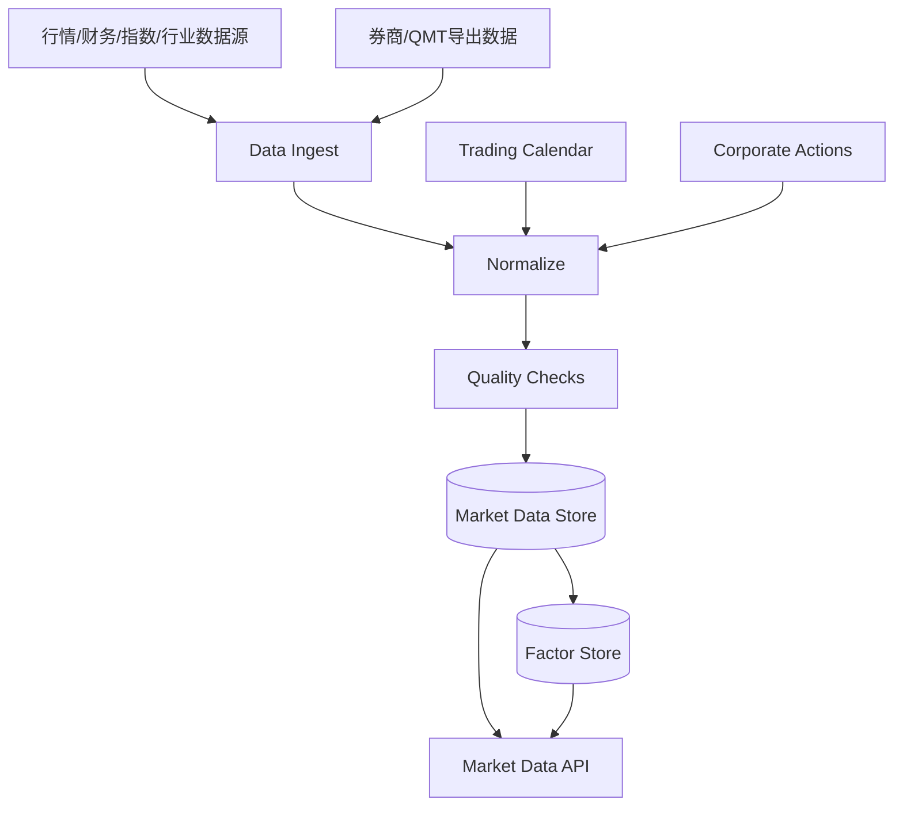

### 详细设计

#### 核心数据类型

```text
Instrument
- symbol
- name
- asset_type
- exchange
- industry
- listed_date
- delisted_date
- lot_size
- tags

DailyBar
- symbol
- trading_date
- open
- high
- low
- close
- pre_close
- volume
- amount
- adj_factor
- adj_close
- suspended
- limit_up
- limit_down
- is_st
- data_version

MinuteBar
- symbol
- trading_time
- open
- high
- low
- close
- volume
- amount
- data_version

CorporateAction
- symbol
- ex_date
- action_type
- factor
- cash_dividend
- stock_dividend

TradingCalendar
- exchange
- trading_date
- is_open
- session_open
- session_close
```

#### 存储策略

| 数据 | 建议存储 | 原因 |
|---|---|---|
| instrument 元数据 | PostgreSQL | 查询、过滤、管理方便 |
| daily bars | Parquet + PostgreSQL 索引 | 数据量大，适合批量研究 |
| minute bars | Parquet | 数据量更大 |
| latest quotes | Redis | 实时查询 |
| factors | Parquet / PostgreSQL | 研究和回测复用 |
| data quality report | PostgreSQL | 审计与展示 |

#### 数据质量检查

```text
missing_bar_check
duplicate_bar_check
price_range_check
volume_amount_check
adj_factor_check
calendar_alignment_check
suspension_consistency_check
limit_up_down_check
symbol_lifecycle_check
```

#### API

```text
GET /api/v1/instruments
GET /api/v1/bars/daily?symbol=600519.SH&start=2025-01-01&end=2026-01-01
GET /api/v1/calendar?exchange=SH&year=2026
GET /api/v1/factors?symbol=600519.SH&factor=momentum_20d
GET /api/v1/data-quality/latest
```

### 验收标准

- 同一交易日数据有明确 `data_version`。
- 回测结果记录使用的数据版本。
- 数据缺失、重复、异常价格会生成质量报告。
- 停牌、涨跌停、ST、退市标签可被策略和风控使用。

---

## 6.3 `quant-research`：研究与策略平台

### 设计目标

`quant-research` 是研究、分析、策略、回测、信号生成的核心服务。它不直接下单，只输出可解释、可审计、可验证的信号。

目标：

1. 支持策略开发、因子研究、行情分析、个股分析。
2. 支持多引擎回测。
3. 支持 paper 前的离线验证。
4. 支持信号生成、解释和发布。
5. 支持 Web Console 查询研究结果。

### 内部结构

```text
quant-research
├── analyzers
│   ├── market_regime_analyzer.py
│   ├── market_breadth_analyzer.py
│   ├── sector_rotation_analyzer.py
│   ├── stock_technical_analyzer.py
│   ├── stock_fundamental_analyzer.py
│   └── liquidity_analyzer.py
├── factors
│   ├── momentum.py
│   ├── volatility.py
│   ├── valuation.py
│   ├── quality.py
│   ├── growth.py
│   └── liquidity.py
├── strategies
│   ├── base.py
│   ├── etf_rotation.py
│   ├── stock_factor_rank.py
│   ├── index_enhancement.py
│   └── portfolio_optimizer.py
├── decision
│   ├── decision_context.py
│   ├── score_model.py
│   ├── risk_budget.py
│   └── target_portfolio_builder.py
├── backtest
│   ├── request.py
│   ├── result.py
│   ├── metrics.py
│   └── report.py
├── engines
│   ├── daily_bar_smoke_engine.py
│   ├── backtrader_adapter.py
│   ├── vectorbt_adapter.py
│   ├── lean_adapter.py
│   └── vnpy_adapter.py
├── signal
│   ├── signal_builder.py
│   ├── signal_validator.py
│   ├── signal_explainer.py
│   └── signal_publisher.py
└── serve
    ├── main.py
    ├── routes_market.py
    ├── routes_stock.py
    ├── routes_backtest.py
    ├── routes_strategy.py
    └── routes_signal.py
```

### 研究工作流

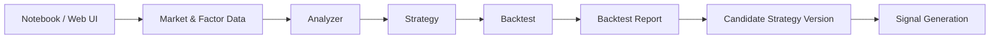

### 策略接口

```python
class Strategy:
    strategy_id: str
    strategy_version: str

    def analyze(self, context: DecisionContext) -> AnalysisResult:
        ...

    def decide(self, context: DecisionContext, analysis: AnalysisResult) -> TargetPortfolio:
        ...

    def explain(self, context: DecisionContext, decision: TargetPortfolio) -> StrategyExplanation:
        ...
```

### 关键输出

```text
AnalysisResult
- market_regime
- stock_scores
- sector_scores
- risk_state
- data_quality
- explanations

TargetPortfolio
- cash_target_pct
- target_positions
- risk_budget
- rebalance_cycle

StrategyExplanation
- top_reasons
- factor_contributions
- rejected_symbols
- risk_notes
```

### 验收标准

- 每个策略都有 `strategy_id` 和 `strategy_version`。
- 每个策略输出都能解释原因。
- 每次策略运行都记录数据版本。
- 策略结果可以被回测、纸交易、信号服务复用。
- 策略不得直接调用 Broker。

---

## 6.4 `market-analyzer`：行情分析模块

### 设计目标

行情分析模块判断市场环境，告诉策略“当前市场是否适合进攻、是否需要防守、哪些行业更强、是否存在异常风险”。

目标：

1. 判断大盘趋势。
2. 判断市场宽度。
3. 判断成交活跃度。
4. 判断波动率和风险状态。
5. 判断行业/主题强弱。
6. 输出可解释的市场状态。

### 输入数据

```text
指数日线/分钟线
全市场涨跌家数
成交额
行业指数
波动率指标
涨跌停数量
北向/资金流数据（可选）
宏观/事件标签（可选）
```

### 输出结构

```json
{
  "trading_date": "2026-05-13",
  "market_regime": "risk_on",
  "trend_score": 0.76,
  "breadth_score": 0.64,
  "liquidity_score": 0.71,
  "volatility_score": 0.38,
  "sector_strength": [
    {"sector": "半导体", "score": 0.82},
    {"sector": "消费", "score": 0.61}
  ],
  "risk_flags": [],
  "explanation": [
    "沪深300位于20日均线上方",
    "上涨家数占比超过60%",
    "成交额较过去20日均值放大"
  ]
}
```

### 指标设计

| 类别 | 指标 |
|---|---|
| 趋势 | MA20/MA60、指数动量、突破状态 |
| 宽度 | 上涨家数占比、创新高/新低数量、强势股比例 |
| 流动性 | 成交额、换手率、量能变化 |
| 风险 | 波动率、回撤、跌停数量、跳空下跌 |
| 行业 | 行业动量、行业成交额、行业相对强弱 |

### 决策使用方式

```text
risk_on:
  提高股票仓位
  降低现金比例
  允许更多进攻型行业

neutral:
  保持中性仓位
  控制换手
  优先高质量/高流动性标的

risk_off:
  提高现金/ETF/防御资产
  降低单票仓位
  关闭新开仓或只允许减仓
```

### 验收标准

- 每个市场状态都有可解释原因。
- 极端行情能触发 `risk_off`。
- 输出可以被策略、风控和 Web Console 使用。
- 市场状态变化会记录到数据库。

---

## 6.5 `stock-analyzer`：个股分析模块

### 设计目标

个股分析模块负责为股票打分、排序、过滤和解释，输出可用于组合构建的个股候选池。

目标：

1. 过滤不可交易标的。
2. 计算多维因子。
3. 给出个股综合评分。
4. 给出买入/持有/卖出/回避理由。
5. 给策略提供候选池和权重建议。

### 输入数据

```text
日线/分钟线
财务数据
估值数据
行业数据
停牌/ST/退市标签
成交额/流动性数据
公司行为
事件标签
```

### 输出结构

```json
{
  "symbol": "600519.SH",
  "trading_date": "2026-05-13",
  "tradable": true,
  "score": 0.78,
  "rank": 12,
  "factor_scores": {
    "momentum": 0.71,
    "quality": 0.91,
    "valuation": 0.52,
    "liquidity": 0.87,
    "volatility_risk": 0.33
  },
  "risk_flags": [],
  "suggestion": "candidate",
  "explanation": [
    "盈利质量较高",
    "流动性充足",
    "短期动量良好",
    "估值分位中性"
  ]
}
```

### 分析维度

| 维度 | 示例指标 | 用途 |
|---|---|---|
| 动量 | 20/60/120 日收益、相对强弱 | 找强势标的 |
| 波动 | 年化波动、最大回撤、下行波动 | 控制风险 |
| 流动性 | 日均成交额、换手率、盘口可得性 | 避免无法成交 |
| 估值 | PE、PB、PS、分位数 | 避免过度高估 |
| 质量 | ROE、毛利率、现金流、负债率 | 选择稳健公司 |
| 成长 | 收入增速、利润增速 | 找成长标的 |
| 标签 | ST、退市、停牌、黑名单 | 强制过滤 |

### 股票过滤规则

```text
必须过滤：
- ST
- 退市整理
- 长期停牌
- 日均成交额低于阈值
- 上市时间过短
- 财务异常
- 黑名单
- 当前无法交易
```

### 验收标准

- 每个入选标的都有评分和解释。
- 每个被剔除标的有剔除原因。
- 个股评分可回放。
- 个股分析结果可用于回测和实盘同源决策。

---

## 6.6 `decision-engine`：策略决策模块

### 设计目标

决策模块把行情分析、个股分析、策略规则、风险预算和账户约束整合成目标组合。

目标：

1. 输入市场状态和候选个股。
2. 输出目标组合。
3. 控制仓位、现金、行业暴露、单票上限。
4. 提供决策解释。
5. 生成可用于信号服务的 `TargetPortfolio`。

### 决策流程

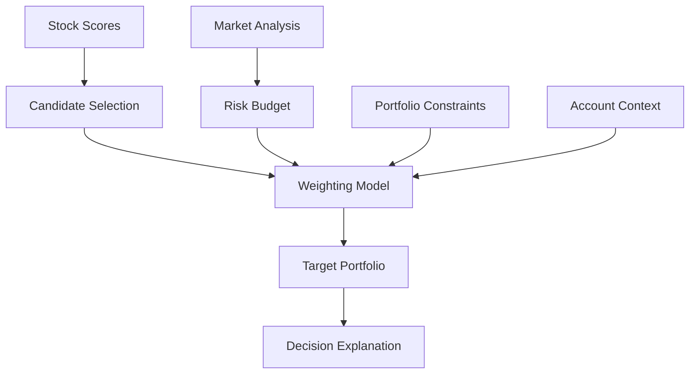

### 详细设计

#### DecisionContext

```text
DecisionContext
- account_id
- trading_date
- strategy_id
- strategy_version
- market_analysis
- stock_analysis
- current_positions
- cash
- data_version
- risk_config
- universe
```

#### TargetPortfolio

```text
TargetPortfolio
- cash_target_pct
- targets:
  - symbol
  - target_pct
  - confidence
  - reason
- constraints
- explanation
```

#### 风险预算

```text
risk_on:
  max_equity_pct = 0.85
  cash_target_pct = 0.15
  max_single_position_pct = 0.10

neutral:
  max_equity_pct = 0.65
  cash_target_pct = 0.35
  max_single_position_pct = 0.08

risk_off:
  max_equity_pct = 0.30
  cash_target_pct = 0.70
  max_single_position_pct = 0.05
```

### 验收标准

- 输出组合权重之和不超过 1。
- 现金比例与风险状态一致。
- 单票、行业、换手约束可配置。
- 每个目标仓位都有 reason。
- 同一输入得到确定性输出。

---

## 6.7 `backtest-engine`：回测引擎模块

### 设计目标

回测模块验证策略在历史数据上的表现。它不应该绑定单一实现，而应支持多引擎 Adapter。

目标：

1. 支持当前自研日线 smoke backtest。
2. 支持接入成熟开源回测框架。
3. 统一回测请求、结果、指标、报告。
4. 支持多参数、多窗口、walk-forward。
5. 支持 A 股交易规则。

### 架构

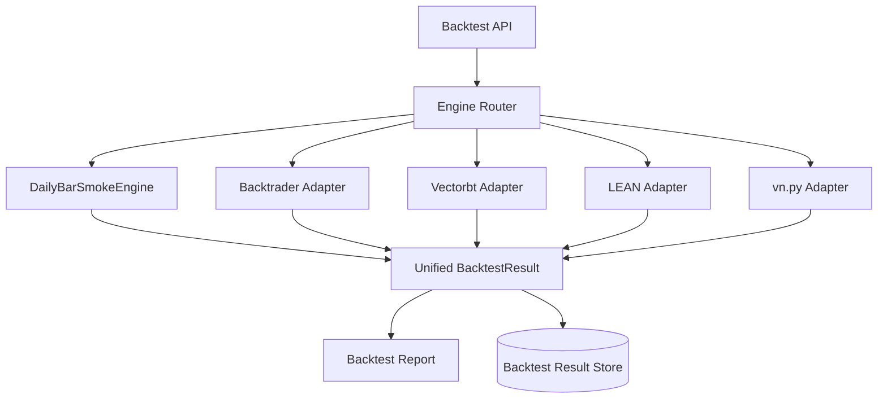

### BacktestRequest

```text
BacktestRequest
- run_id
- strategy_id
- strategy_version
- engine_type
- universe
- start_date
- end_date
- initial_cash
- benchmark
- fee_model
- slippage_model
- data_version
- parameters
```

### BacktestResult

```text
BacktestResult
- run_id
- metrics
- equity_curve
- drawdown_curve
- orders
- fills
- positions
- exposure
- turnover
- factor_exposure
- risk_report
- data_version
- created_at
```

### 指标

```text
收益类：
- total_return
- annual_return
- excess_return
- benchmark_return

风险类：
- max_drawdown
- volatility
- downside_volatility
- sharpe
- sortino
- calmar

交易类：
- turnover
- trade_count
- win_rate
- avg_profit
- avg_loss
- fee_total
- slippage_total

稳定性：
- monthly_return
- rolling_sharpe
- rolling_drawdown
- parameter_sensitivity
```

### A 股交易规则

```text
- 100 股一手
- T+1 可卖
- 涨跌停不可按理想价成交
- 停牌不可成交
- ST/退市过滤
- 佣金
- 印花税
- 过户费（如需要）
- 滑点
- 成交量限制
- 开盘/收盘价可用性
```

### 验收标准

- 回测信号时间和交易时间严格分离。
- 回测结果记录数据版本和策略版本。
- 同一配置可复现。
- 当前自研引擎仅作为 smoke engine，不作为唯一长期回测引擎。
- 回测报告可在 Web Console 查看。

---

## 6.8 `paper-trading`：纸交易模块

### 设计目标

纸交易模块在不真实下单的情况下模拟执行链路，用来验证策略、信号、风控、订单规划、账本、对账。

目标：

1. 尽可能复用实盘执行链路。
2. 提供模拟账户、模拟订单、模拟成交、模拟持仓。
3. 支持订单状态机。
4. 支持模拟滑点、部分成交、失败、撤单。
5. 支持故障注入和回放测试。

### 纸交易架构

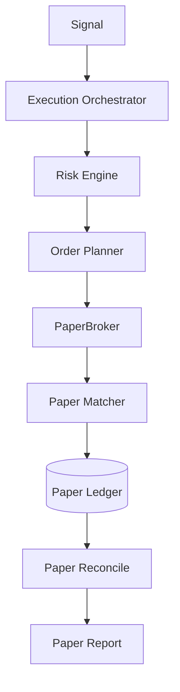

### PaperBroker 设计

```text
PaperBroker
- place_orders(intents)
- cancel(order_id)
- query_orders()
- query_positions()
- query_account()
- query_fills()
```

### PaperMatcher 成交模型

```text
模式一：立即成交
- 适合 smoke test

模式二：按 bar 成交
- 用日线/分钟线 close/open 模拟

模式三：带成交量限制
- 每根 bar 最多成交 volume 的一定比例

模式四：故障注入
- 随机 reject
- 随机 partial fill
- 随机 delayed fill
- 随机 unknown status
```

### 订单状态

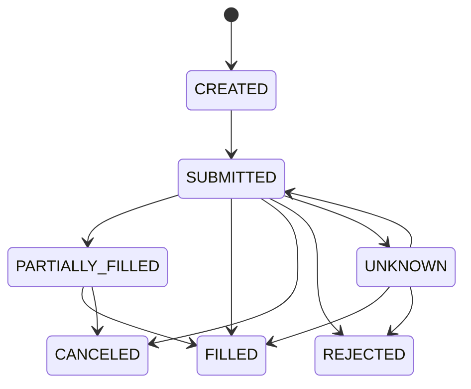

### 验收标准

- paper 和 live 使用同一个 `ExecutionOrchestrator`。
- paper 能模拟失败、部分成交和撤单。
- paper 结果写入 ledger。
- paper 能产生日报和对账结果。
- 连续 paper 通过才允许进入 live-readonly。

---

## 6.9 `signal-service`：信号服务模块

### 设计目标

信号服务是策略和执行之间的唯一桥梁。它负责将策略决策转换为标准化、可验证、可审计的信号。

目标：

1. 生成目标组合信号。
2. 校验 schema、权重、约束、数据版本。
3. 生成稳定幂等键。
4. 生成 checksum。
5. 存储并发布信号。
6. 提供信号解释。
7. 支持执行器消费和 Web 查看。

### 信号状态机

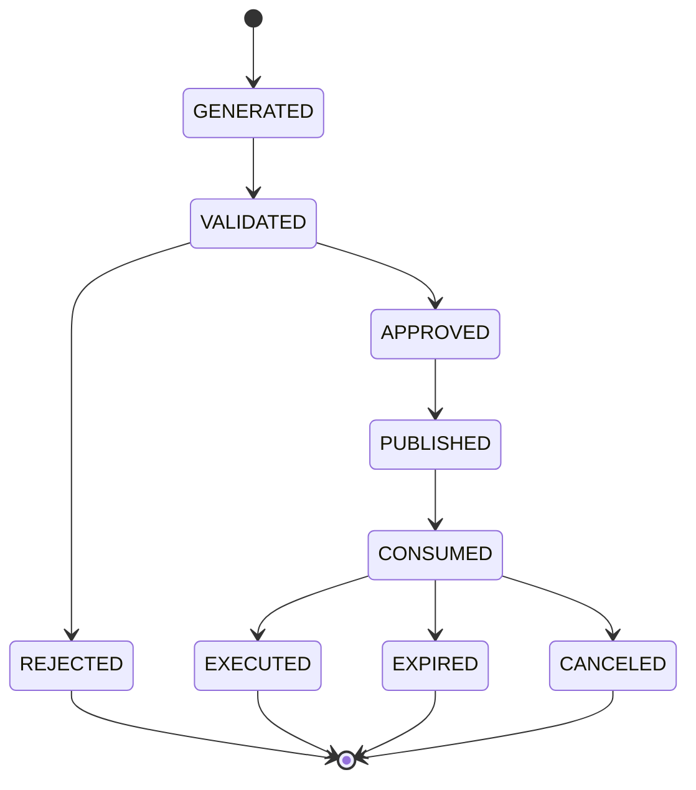

### 数据表

```text
signal_log
- id
- signal_id
- account_id
- strategy_id
- strategy_version
- trading_date
- rebalance_cycle
- status
- payload_json
- checksum
- idempotency_key
- data_version
- created_at
- validated_at
- published_at
- consumed_at
- expired_at
```

### API

```text
POST /api/v1/signals/generate
POST /api/v1/signals/{signal_id}/validate
POST /api/v1/signals/{signal_id}/publish
GET  /api/v1/signals/latest?account_id=acct-main-a
GET  /api/v1/signals/{signal_id}
GET  /api/v1/signals/{signal_id}/explain
```

### 验收标准

- 同一策略、账户、交易日、周期只能有一个有效幂等信号。
- checksum 可校验 payload 是否被篡改。
- 过期信号不能被执行。
- 未发布信号不能被执行器消费。
- 信号解释可在 Web Console 查看。

---

## 6.10 `trade-executor`：交易执行模块

### 设计目标

`trade-executor` 是生产交易核心。它消费信号，执行风控，生成订单计划，通过 Broker Gateway 下单，记录账本，执行对账和告警。

目标：

1. 保证不重复下单。
2. 保证风控前置。
3. 保证订单状态可追踪。
4. 保证执行过程可审计。
5. 保证异常可恢复。
6. 保证 live 可随时熔断。

### 架构

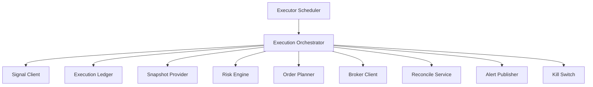

### 执行流程

```text
1. 检查 Kill Switch
2. 获取 latest published signal
3. 校验 signal checksum
4. 检查 idempotency_key 是否已处理
5. 保存 signal consumed event
6. 获取账户快照
7. 执行风控
8. 风控通过后生成订单计划
9. 保存订单计划
10. 提交订单
11. 保存 broker order id
12. 轮询订单状态和成交
13. 保存 fills
14. 更新持仓快照
15. 执行对账
16. 标记 processed
17. 输出 execution report
```

### ExecutionReport

```text
ExecutionReport
- account_id
- signal_id
- idempotency_key
- status
- risk_decision
- planned_order_count
- submitted_order_count
- filled_order_count
- rejected_order_count
- reconcile_status
- started_at
- finished_at
- trace_id
```

### 验收标准

- 同一 `idempotency_key` 重复执行不会重复下单。
- 执行中断后可以通过 ledger 恢复。
- broker 返回 unknown 时不能盲目重试下单。
- risk rejected 时必须写入账本。
- live 模式下 Kill Switch 生效优先级最高。

---

## 6.11 `risk-engine`：风控模块

### 设计目标

风控模块负责在真实下单前阻断不安全交易。

目标：

1. 检查信号是否合法。
2. 检查账户风险。
3. 检查订单计划风险。
4. 检查市场状态风险。
5. 支持熔断。
6. 支持人工审批。

### 风控分层

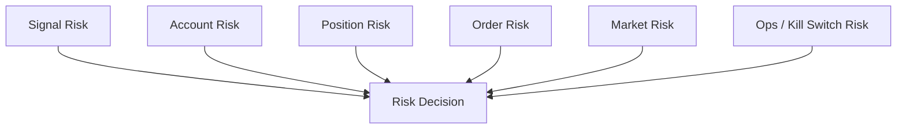

### 规则列表

| 风控规则 | 说明 |
|---|---|
| schema 校验 | signal 必须符合 contract |
| checksum 校验 | 防止 payload 被篡改 |
| idempotency 校验 | 防止重复执行 |
| 交易日校验 | 信号必须属于当前可执行周期 |
| 单票上限 | 不超过配置的最大单票仓位 |
| 行业上限 | 不超过行业暴露上限 |
| 账户现金 | 买入不得超过可用资金 |
| T+1 可卖 | 卖出不得超过可卖数量 |
| 黑名单 | 禁止交易黑名单标的 |
| ST/退市 | 禁止买入高风险标签 |
| 停牌 | 禁止交易停牌标的 |
| 涨跌停 | 根据规则禁止或限制交易 |
| 单日亏损 | 达到阈值触发熔断 |
| 最大回撤 | 达到阈值触发熔断 |
| 最大换手 | 超过换手限制则缩放订单 |
| 最大订单数 | 限制异常下单 |
| 人工审批 | live-small 阶段必须审批 |
| Kill Switch | 全局停止开关 |

### RiskDecision

```text
RiskDecision
- approved
- severity
- messages
- rejected_rules
- allowed_turnover_pct
- require_manual_approval
- kill_switch_active
```

### 验收标准

- 每条拒绝都有明确原因。
- 风控决策写入数据库。
- Kill Switch 可在任何阶段阻断下单。
- 风控规则可配置、可测试、可回放。
- 风控失败不允许进入 Broker 调用。

---

## 6.12 `order-planner`：订单规划模块

### 设计目标

订单规划模块把目标组合转换为具体订单意图。

目标：

1. 根据当前持仓和目标权重计算差额。
2. 处理 A 股 100 股一手。
3. 处理 T+1 可卖限制。
4. 控制换手。
5. 控制现金。
6. 生成限价、数量、方向。
7. 支持先卖后买。

### 流程

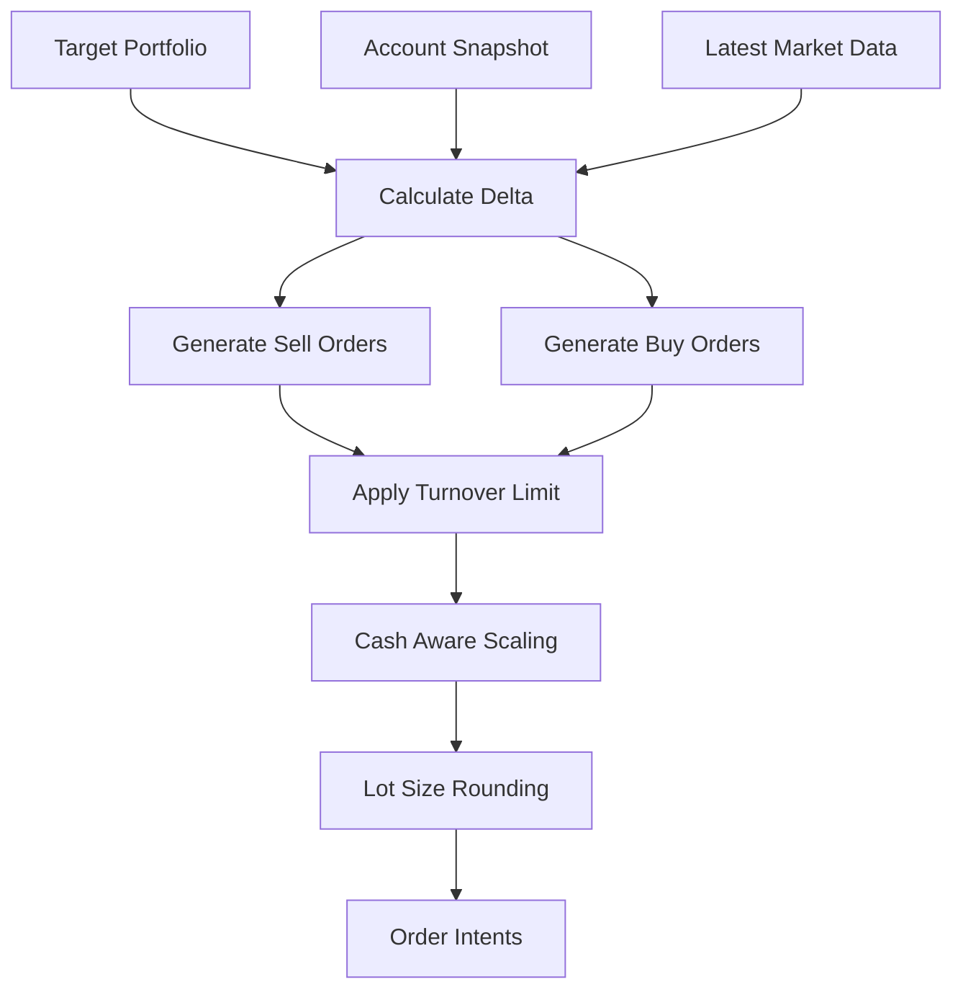

### OrderIntent

```text
OrderIntent
- client_order_id
- account_id
- signal_id
- symbol
- side
- quantity
- order_type
- limit_price
- time_in_force
- reason
```

### 订单规划细节

1. **先卖后买**：释放现金，降低买入资金不足风险。
2. **向下取整**：A 股按 100 股取整，避免非法数量。
3. **现金保护**：保留最小现金缓冲。
4. **涨跌停保护**：涨停不追买，跌停不假设能卖出。
5. **成交量限制**：订单量不超过近 N 日成交量的一定比例。
6. **小订单过滤**：低于最小交易金额不下单。
7. **换手缩放**：超过 max_turnover_pct 时按比例缩放。

### 验收标准

- 输出订单数量均为 100 的整数倍。
- 不卖出超过可卖数量。
- 买入金额不超过可用资金。
- 订单计划可解释。
- 同一输入得到确定性输出。

---

## 6.13 `execution-ledger`：执行账本模块

### 设计目标

执行账本是实盘交易安全的核心。它保存信号、风控、订单计划、实际订单、成交、持仓、PnL、对账结果。

目标：

1. 全链路审计。
2. 幂等保护。
3. 异常恢复。
4. 盘后对账。
5. 事故回放。
6. 报告生成。

### 核心表

```text
signal_log
risk_decision
order_plan
orders
order_events
fills
account_snapshot
positions_snapshot
pnl_daily
reconcile_result
kill_switch_event
execution_run
```

### execution_run

```text
execution_run
- run_id
- account_id
- signal_id
- idempotency_key
- status
- mode
- started_at
- finished_at
- trace_id
- error_message
```

### orders

```text
orders
- id
- client_order_id
- broker_order_id
- account_id
- signal_id
- symbol
- side
- order_type
- quantity
- limit_price
- status
- submitted_at
- updated_at
- trace_id
```

### fills

```text
fills
- id
- broker_order_id
- account_id
- symbol
- side
- quantity
- price
- amount
- commission
- tax
- trade_time
- trace_id
```

### 验收标准

- 每个执行 run 有 trace_id。
- 每个订单能追溯到 signal_id。
- 每个成交能追溯到 broker_order_id。
- 重启后能恢复未完成订单状态。
- 对账不一致会生成告警。

---

## 6.14 `broker-gateway`：券商网关模块

### 设计目标

Broker Gateway 隔离真实券商 API 和核心执行系统。它对 trade-executor 提供统一接口，对下适配 QMT、Paper、未来其他 broker。

目标：

1. 隔离券商 SDK 依赖。
2. 统一账户、持仓、订单、成交接口。
3. 支持 Paper / Sim / QMT / Live 模式切换。
4. 支持心跳、重连、异常映射。
5. 支持 broker 原始响应审计。

### 架构

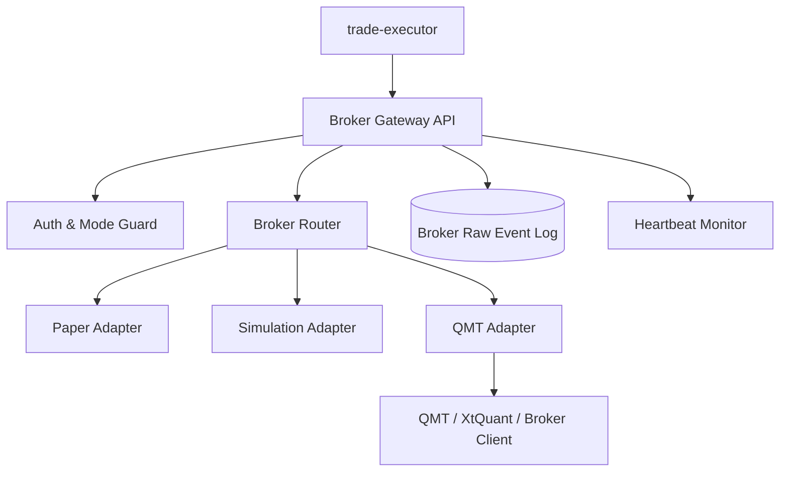

### API

```text
GET  /health
GET  /account
GET  /positions
GET  /orders
GET  /fills
POST /orders
DELETE /orders/{broker_order_id}
GET  /mode
POST /mode
```

### 下单请求

```json
{
  "client_order_id": "coid-20260513-000001",
  "account_id": "acct-main-a",
  "symbol": "510300.SH",
  "side": "BUY",
  "quantity": 1000,
  "order_type": "LIMIT",
  "limit_price": 4.12,
  "trace_id": "trace-..."
}
```

### 安全设计

1. live 模式必须显式开启。
2. live 模式必须检查 Kill Switch。
3. live-small 阶段必须限制单笔金额。
4. 所有 broker 原始响应入库或落日志。
5. broker unknown 状态不自动重复下单。
6. 心跳失败时停止新开仓。

### 验收标准

- readonly 模式不能下单。
- paper / sim / qmt 模式可配置切换。
- QMT 断线可检测。
- 所有报单有 client_order_id。
- 所有 broker_order_id 可回查。

---

## 6.15 `web-console`：Web 控制台

### 设计目标

Web Console 是研究、回测、纸交易、实盘、风控和运维的统一入口。

目标：

1. 查看系统状态。
2. 查看行情和个股分析。
3. 管理策略和回测。
4. 查看信号和解释。
5. 查看纸交易和实盘账户。
6. 管理风控参数。
7. 查看订单、成交、对账和告警。
8. 执行人工审批和 Kill Switch。

### 页面结构

```text
web-console
├── Dashboard
│   ├── 系统健康
│   ├── 今日市场状态
│   ├── 最新信号
│   ├── 执行状态
│   └── 告警
├── Market
│   ├── 指数分析
│   ├── 市场宽度
│   ├── 行业轮动
│   └── 风险状态
├── Stock
│   ├── 个股评分
│   ├── 因子详情
│   ├── 风险标签
│   └── 入选/剔除原因
├── Research
│   ├── 策略列表
│   ├── 策略版本
│   ├── 参数配置
│   └── Notebook 链接
├── Backtest
│   ├── 回测运行
│   ├── 回测报告
│   ├── 收益曲线
│   ├── 回撤曲线
│   └── 交易明细
├── Signal
│   ├── 信号列表
│   ├── 信号详情
│   ├── 信号解释
│   └── 发布状态
├── Paper
│   ├── 模拟账户
│   ├── 模拟订单
│   ├── 模拟成交
│   └── 模拟 PnL
├── Live
│   ├── 实盘账户
│   ├── 实盘持仓
│   ├── 实盘订单
│   ├── 实盘成交
│   └── 对账结果
└── Risk/Ops
    ├── 风控配置
    ├── 审批队列
    ├── Kill Switch
    ├── 告警
    └── 事故回放
```

### 关键交互

```text
生成回测 -> 查看报告 -> 保存策略版本
生成信号 -> 查看解释 -> 发布信号
执行器拉取信号 -> 风控结果 -> 订单计划 -> 确认执行
实盘异常 -> 启用 Kill Switch -> 降级到 paper
```

### 验收标准

- 所有执行链路状态可视化。
- 所有信号可查看解释。
- 所有订单可追溯到信号。
- 可一键启用 Kill Switch。
- 人工审批操作写入审计日志。

---

## 6.16 `observability`：监控、告警、运维模块

### 设计目标

监控模块保证系统异常能及时发现、定位和回放。

目标：

1. 监控服务健康。
2. 监控信号生成和执行。
3. 监控 broker gateway。
4. 监控订单失败率。
5. 监控对账不一致。
6. 监控风险熔断。
7. 提供事故回放。

### 指标

```text
service_up
signal_generated_total
signal_validation_failed_total
execution_run_total
execution_failed_total
risk_rejected_total
orders_submitted_total
orders_failed_total
orders_unknown_total
fills_total
reconcile_mismatch_total
broker_heartbeat_lag_seconds
kill_switch_active
```

### 告警规则

| 告警 | 触发条件 |
|---|---|
| SignalUnavailable | 连续 3 次拉取信号失败 |
| BrokerHeartbeatLost | broker heartbeat 超过阈值 |
| OrderFailureHigh | 单批订单失败率超过 20% |
| RiskCircuitBreaker | 单日亏损或最大回撤触发 |
| ReconcileMismatch | 对账不一致 |
| UnknownOrderStatus | 订单状态 unknown 超时 |
| KillSwitchEnabled | Kill Switch 被启用 |
| DataQualityFailed | 数据质量检查失败 |

### 验收标准

- 每个 execution run 有 trace_id。
- 每个告警能定位到 signal_id / account_id。
- 重要告警可推送到外部渠道。
- 事故后可按 trace_id 回放。

---

# 7. 数据库设计

## 7.1 数据库分区

```text
research schema:
- strategy_run
- backtest_run
- analysis_result
- factor_snapshot
- signal_log

execution schema:
- execution_run
- risk_decision
- order_plan
- orders
- order_events
- fills
- account_snapshot
- positions_snapshot
- pnl_daily
- reconcile_result

ops schema:
- kill_switch_event
- alert_event
- approval_event
- audit_log
```

## 7.2 关键表关系

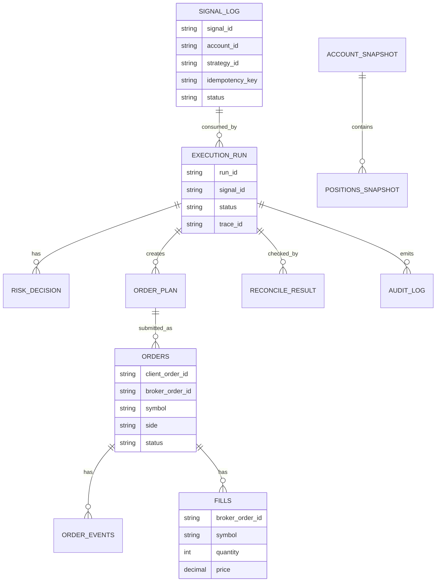

---

# 8. API 设计

## 8.1 Research API

```text
GET  /api/v1/overview
GET  /api/v1/instruments
GET  /api/v1/market-bars
GET  /api/v1/market-analysis/latest
GET  /api/v1/stocks/{symbol}/analysis
POST /api/v1/strategy-runs
GET  /api/v1/strategy-runs/{run_id}
POST /api/v1/backtest-runs
GET  /api/v1/backtest-runs/{run_id}
POST /api/v1/signals/generate
GET  /api/v1/signals/latest
GET  /api/v1/signals/{signal_id}
GET  /api/v1/signals/{signal_id}/explain
```

## 8.2 Executor API

```text
POST /api/v1/execution/run-once
GET  /api/v1/execution/runs/{run_id}
GET  /api/v1/orders
GET  /api/v1/fills
GET  /api/v1/positions
GET  /api/v1/reconcile/latest
POST /api/v1/kill-switch/enable
POST /api/v1/kill-switch/disable
GET  /api/v1/risk/decisions
```

## 8.3 Broker Gateway API

```text
GET  /health
GET  /account
GET  /positions
GET  /orders
GET  /fills
POST /orders
DELETE /orders/{order_id}
GET  /mode
POST /mode
```

---

# 9. 开源框架接入策略

## 9.1 接入原则

开源框架只作为引擎插件，不作为整个平台底座。

```text
你的系统负责：
- 数据治理
- 信号服务
- 风控
- 执行
- Broker Gateway
- 账本
- 对账
- Web Console
- 监控与运维

开源框架负责：
- 回测引擎
- 策略运行
- 指标计算
- 参数优化
- 某些品种/接口适配参考
```

## 9.2 Adapter 方式

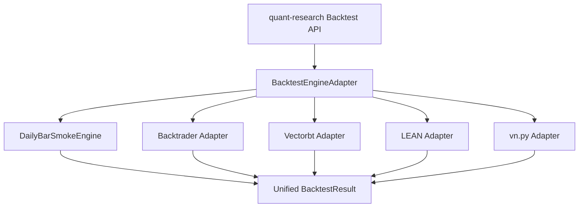

## 9.3 不建议的做法

不要：

1. 魔改开源框架源码作为主平台。
2. 让开源框架直接操作真实账户。
3. 让策略绕过 signal contract 直接下单。
4. 把风控和执行账本交给研究框架。
5. 在未完成 paper / live-readonly / live-sim 前直接实盘。

---

# 10. 端到端工作流

## 10.1 研究工作流

```text
选择股票池
  ↓
加载数据版本
  ↓
计算因子
  ↓
分析市场状态
  ↓
分析个股评分
  ↓
生成策略候选
  ↓
运行回测
  ↓
保存策略版本
```

## 10.2 回测工作流

```text
BacktestRequest
  ↓
选择回测引擎
  ↓
加载数据版本
  ↓
策略按时间生成目标组合
  ↓
模拟撮合
  ↓
生成订单/成交/持仓/权益曲线
  ↓
计算指标
  ↓
保存报告
```

## 10.3 信号工作流

```text
策略版本 + 账户 + 交易日
  ↓
生成目标组合
  ↓
校验权重和约束
  ↓
生成 checksum
  ↓
生成稳定 idempotency_key
  ↓
保存 signal_log
  ↓
发布信号
```

## 10.4 纸交易工作流

```text
Executor 拉取信号
  ↓
风控
  ↓
订单规划
  ↓
PaperBroker 模拟执行
  ↓
保存订单和成交
  ↓
更新模拟持仓
  ↓
模拟对账
  ↓
生成 paper report
```

## 10.5 实盘工作流

```text
live-readonly 验证账户读取
  ↓
live-sim 验证真实快照模拟执行
  ↓
live-small 小额人工审批实盘
  ↓
live 全自动但保留 Kill Switch
```

---

# 11. 测试设计

## 11.1 测试金字塔

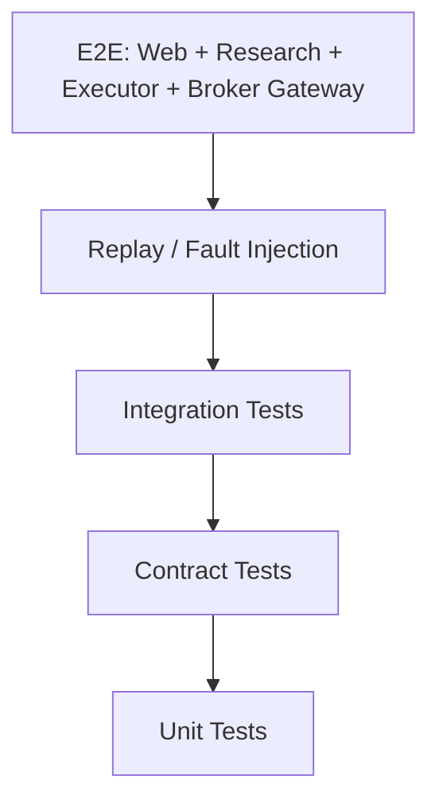

## 11.2 必测场景

### 信号

```text
- schema 缺字段被拒绝
- 权重超过 1 被拒绝
- checksum 不一致被拒绝
- 过期信号被拒绝
- 同一 idempotency_key 不重复执行
```

### 风控

```text
- 单票超限
- 现金不足
- T+1 不可卖
- ST/停牌/黑名单
- 单日亏损熔断
- 最大回撤熔断
- Kill Switch 开启
```

### 订单

```text
- 买入向下取整到 100 股
- 卖出不超过可卖数量
- 部分成交
- broker reject
- broker unknown
- cancel
- 重启恢复
```

### 对账

```text
- 订单一致
- 成交一致
- 持仓一致
- 资金一致
- 不一致触发告警
```

### E2E

```text
- 生成信号 -> 执行 -> 下单 -> 成交 -> 对账
- 重复执行同一信号不重复下单
- 执行中断后恢复
- Kill Switch 阻断实盘
```

---

# 12. 安全与风险控制

## 12.1 关键安全原则

1. 不硬编码真实账号、密码、token。
2. live 模式必须显式开启。
3. 下单权限与查询权限分离。
4. Web 上的 live 操作必须审计。
5. Kill Switch 优先级高于所有执行逻辑。
6. broker unknown 状态不得盲目重试报单。
7. 所有外部输入必须校验。
8. 所有生产参数必须版本化。

## 12.2 Kill Switch 设计

```text
KillSwitch
- scope: GLOBAL / ACCOUNT / STRATEGY / SYMBOL
- enabled
- reason
- created_by
- created_at
- expires_at
```

优先级：

```text
GLOBAL > ACCOUNT > STRATEGY > SYMBOL
```

只要任一 scope 命中，新开仓必须停止。是否允许减仓需要单独配置。

---

# 13. 演进路线图

## Phase 0：修正当前 MVP 边界

目标：

```text
Signal -> Risk -> OrderPlan -> PaperBroker -> Ledger -> Reconcile -> Web
```

任务：

1. 修正信号幂等键。
2. 实现 `HttpSignalClient`。
3. 实现 `JdbcExecutionLedger`。
4. `TradeExecutorApplication` 变成真实入口。
5. PaperBroker 增加订单状态。
6. Web 展示信号、风控、订单、成交。
7. 增加重复执行测试。
8. 增加重启恢复测试。

验收：

- 本地 Docker Compose 能跑通完整 paper 执行闭环。
- 同一信号执行两次不会重复下单。
- 执行记录落 PostgreSQL。

## Phase 1：数据平台与分析模块

任务：

1. 新增 `quant-data`。
2. 建立交易日历。
3. 建立 instrument 元数据。
4. 接入真实日线数据。
5. 增加数据质量检查。
6. 增加市场分析和个股分析 API。

验收：

- Web 能查看市场状态。
- Web 能查看个股评分。
- 数据质量报告可查看。

## Phase 2：回测引擎插件化

任务：

1. 定义 `BacktestEngineAdapter`。
2. 当前引擎改名为 `DailyBarSmokeEngine`。
3. 接入至少一个开源回测引擎 Adapter。
4. 统一回测报告格式。
5. 支持参数搜索。

验收：

- 同一策略可以选择不同 engine 运行。
- 回测报告可比较。
- 策略版本与数据版本写入结果。

## Phase 3：纸交易强化

任务：

1. PaperBroker 状态机。
2. Partial fill。
3. Reject。
4. Unknown status。
5. 故障注入。
6. Paper 对账。
7. Paper 日报。

验收：

- 连续 paper 多日运行稳定。
- 故障注入不会重复下单。
- 对账异常可告警。

## Phase 4：Broker Gateway readonly

任务：

1. 独立 `broker-gateway`。
2. 实现 QMT readonly。
3. 查询真实账户、持仓、订单、成交。
4. broker heartbeat。
5. broker raw event log。

验收：

- 连续 N 日读取真实账户稳定。
- live-readonly 对账一致。
- readonly 模式无法下单。

## Phase 5：live-sim 与小额实盘

任务：

1. live-sim 模式。
2. 人工审批。
3. 单笔金额限制。
4. 白名单。
5. 小额实盘。
6. 强制对账。
7. Kill Switch 演练。

验收：

- live-small 连续 N 日无重大异常。
- 所有订单可追溯。
- Kill Switch 可立即阻断新开仓。

## Phase 6：自动实盘

任务：

1. 自动执行调度。
2. 自动对账。
3. 自动报告。
4. 异常自动降级。
5. 事故回放。
6. 长期监控。

验收：

- 全链路稳定。
- 风控、审计、告警、回滚完备。
- 可以从任意 trace_id 回放一次交易。

---

# 14. 模块优先级

| 优先级 | 模块 | 原因 |
|---:|---|---|
| P0 | Signal 幂等 | 防重复下单的基础 |
| P0 | JdbcExecutionLedger | 没有账本不能实盘 |
| P0 | HttpSignalClient | Python 与 Java 闭环必须打通 |
| P0 | PaperBroker 状态机 | paper 是 live 前置验证 |
| P0 | Kill Switch | 实盘安全底线 |
| P1 | Data Quality | 错数据会导致错交易 |
| P1 | Market/Stock Analyzer | 支撑真正决策 |
| P1 | Backtest Adapter | 提升研究能力 |
| P1 | Web Execution View | 执行过程必须可见 |
| P2 | Broker Gateway readonly | 真实 broker 接入第一步 |
| P2 | live-sim | 实盘前最后验证 |
| P3 | live-small | 小额生产验证 |
| P4 | full live | 最终自动化 |

---

# 15. 最终验收清单

系统达到以下条件，才可以认为接近“真正可自动运行真实交易的软件”。

## 15.1 研究侧

- [ ] 支持真实数据源。
- [ ] 支持数据质量检查。
- [ ] 支持市场分析。
- [ ] 支持个股分析。
- [ ] 支持策略版本。
- [ ] 支持多引擎回测。
- [ ] 支持回测报告。
- [ ] 支持策略解释。

## 15.2 信号侧

- [ ] 信号 schema 稳定。
- [ ] 信号幂等键稳定。
- [ ] 信号 checksum 可校验。
- [ ] 信号状态机完整。
- [ ] 信号可解释。
- [ ] 信号可审计。
- [ ] 过期信号不可执行。

## 15.3 执行侧

- [ ] Java 执行器真实运行。
- [ ] PostgreSQL 账本完整。
- [ ] 风控前置。
- [ ] 订单状态机完整。
- [ ] Paper 执行稳定。
- [ ] 重启可恢复。
- [ ] 重复执行不重复下单。
- [ ] broker unknown 不盲目重试。

## 15.4 实盘侧

- [ ] broker readonly 稳定。
- [ ] broker-gateway 心跳可用。
- [ ] live-sim 可用。
- [ ] 小额实盘可控。
- [ ] Kill Switch 可用。
- [ ] 对账可用。
- [ ] 告警可用。
- [ ] 事故可回放。

---

# 16. 关键设计原则回顾

最终系统必须坚持：

```text
平台自研，框架可插拔。
策略产生信号，不直接下单。
信号先校验，再发布，再执行。
执行先风控，再规划，再下单。
所有执行必须入账本。
所有异常必须可恢复。
所有实盘必须可熔断。
所有交易必须可解释、可审计、可回放。
```

---

## 附录 A：一条完整实盘交易链路

```text
T 日 15:30
  quant-data 完成数据更新
  data-quality 通过

T 日 16:00
  market-analyzer 生成市场状态
  stock-analyzer 生成个股评分
  decision-engine 生成目标组合
  signal-service 生成并发布 signal

T 日 16:30
  trade-executor 拉取 signal
  risk-engine 预检查
  order-planner 生成订单计划
  人工审批或自动审批

T+1 日 09:15
  broker-gateway heartbeat 正常
  live mode 与 kill switch 检查通过

T+1 日 09:30
  trade-executor 提交订单
  broker-gateway 返回 broker_order_id
  ledger 保存订单状态

T+1 日盘中
  轮询订单状态
  保存成交回报
  异常触发告警或撤单

T+1 日 15:10
  查询账户、持仓、成交
  执行对账
  生成 PnL
  生成日报
  归档执行记录
```

---

## 附录 B：推荐下一步开发顺序

第一批代码改造建议：

```text
1. contracts/signal 增加 trading_date、strategy_version、rebalance_cycle、data_version
2. quant-research 重构 SignalService 的 idempotency_key
3. trade-executor 实现 HttpSignalClient
4. trade-executor 实现 JdbcExecutionLedger
5. trade-executor 增加 ExecutionRun 表
6. PaperBroker 增加订单状态和账户现金
7. Web 增加执行链路页面
8. 增加 E2E smoke：generate signal -> run executor -> paper order -> ledger
```

第二批代码改造建议：

```text
1. 新建 quant-data
2. 新建 market-analyzer
3. 新建 stock-analyzer
4. 新建 BacktestEngineAdapter
5. 当前 BacktestEngine 改成 DailyBarSmokeEngine
6. 接入一个外部回测引擎 adapter
```

第三批代码改造建议：

```text
1. 新建 broker-gateway
2. PaperGateway 先跑通
3. QMT readonly
4. QMT live-sim
5. live-small
```

---

## 附录 C：最小可落地 MVP

最小可落地版本不追求复杂策略，只追求交易系统闭环安全。

```text
数据：本地日线 CSV / 简单真实日线
策略：固定 ETF + 股票目标权重
信号：稳定幂等 target portfolio signal
执行：Java executor
风控：单票、现金、T+1、换手、Kill Switch
Broker：PaperBroker
账本：PostgreSQL
Web：展示 signal、risk、order、fill、position
测试：重复执行不重复下单，重启恢复
```

这个 MVP 跑稳后，再增强分析、回测和实盘。

---

## 附录 D：最终一句话目标

> 把 `quant-trade` 做成一个“研究可验证、信号可解释、执行可风控、交易可审计、异常可恢复、实盘可熔断”的 A 股量化交易平台。
